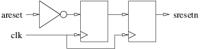
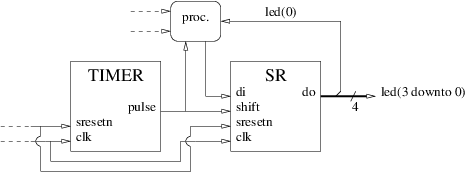

<!-- vim: set textwidth=0: -->

# LED Blinking

In this challenge we will assemble our shift register and our timer to create a LED blinking design.

## Interface

Create a file named `lb.vhd` (for Led Blinking) in your personal subdirectory of `20170427_exercises`, put the necessary library and packages-use declarations and design a entity named `lb` with the following generic parameters:

| Name       | Type                            | Description                                                         |
| :----      | :----                           | :----                                                               |
| `freq`     | `positive range 1 to 1000`      | Master clock frequency in MHz (also clock periods per micro-second) |
| `timeout`  | `positive range 1 to 1000000`   | Number of micro-seconds between two output pulses                   |

... and the following input-output ports:

| Name       | Type                            | Direction | Description                                                              |
| :----      | :----                           | :----     | :----                                                                    |
| `clk`      | `std_ulogic`                    | in        | Master clock. The design is synchronized on the rising edge of `clk`     |
| `areset`   | `std_ulogic`                    | in        | *Asynchronous*, active high reset                                        |
| `led`      | `std_ulogic_vector(3 downto 0)` | out       | Will be wired to the 4 user LEDs                                         |

## Architecture

In the same VHDL source file add a fully combinatorial architecture named `arc` that:

* Instanciates one [shift register](sr.md) and one [timer](timer.md).
* Uses `clk` as its master clock. The design is synchronized on the rising edge of `clk`.
* Inserts an inverter and a 2-stages shift register between the `areset` input and a `sresetn` internal signal to synchronize the asynchronous active high reset and deliver a synchronized active *low* reset:

* Uses `sresetn` as a *synchronous*, active *low* reset.
* Configures the timer for a `freq` clock frequency and a `timeout` timeout.
* Connects the timer `pulse` output to the `shift` input of the shift register.
* Contains the necessary process(es) to inject a single `'1'` in the shift register the first time it shifts, and then loop back the rightmost output bit to the input. This will turn it into a rotating 4-bits register with 3 of the stored bits unset and one set. Decide whether it/they shall be synchronous or combinatorial.
* Sends the current value of the shift register to the `led` output.



## Compilation

Check (at least) that your design compiles. Do not forget that it depends on `sr.arc` and `timer.arc` and that the `sr.vhd` and `timer.vhd` source files must thus be compiled before `lb.vhd` can be:

### With `ghdl`:

```bash
cd $o
ghdl -a --std=08 $r/sr.vhd $r/timer.vhd $r/lb.vhd
cd $r
```

### With Modelsim:

```bash
cd $o
vcom -novopt -2008 $r/sr.vhd $r/timer.vhd $r/lb.vhd
cd $r
```

If it compiles you can add-commit-push, let me know and wait until you receive the email with the result of the automatic evaluation (see the **Commit** section below). But of course, it would be much better if you were validating your design yourself with your own simulation environment (see the **Simulation** section below) before pushing.

## Simulation

Create a file named `lb_sim.vhd` in your personal subdirectory containing `lb_sim.sim`, the VHDL model of a simulation environment for `lb.arc`. Compile and simulate your design (in order to have reasonable simulation times, set the generic parameters to small values instead of the default):

### With `ghdl` and `gtkwave`:

```bash
cd $o
ghdl -a --std=08 $r/sr.vhd $r/timer.vhd $r/lb.vhd $r/lb_sim.vhd
ghdl -e --std=08 lb_sim
./lb_sim --vcd=- | gtkwave --vcd
cd $r
```

### With Modelsim:

```bash
cd $o
vcom -novopt -2008 $r/sr.vhd $r/timer.vhd $r/lb.vhd $r/lb_sim.vhd
vsim -novopt lb_sim
cd $r
```

## Commit

As soon as you are satisfied with the results, and before the time limit, commit your work:

```
cd $r
n=lb.vhd
git add $n; git ci -m 'Add $n'; git pull; git push
```

(to reduce the risk of collisions with others, copy paste the complete `git...` command line and execute the 4 `git` commands at once).

## Peer review

Discuss your solution with your neighbour. Have a look at mine. Ask questions.

## Logic synthesis

We will now synthesise our design with the Vivado tool by Xilinx to map it in the programmable logic part of the Zynq core of the Zybo. The `20170427_exercises/lb-syn.tcl` TCL script will automate the synthesis and the `20170427_exercises/boot.bif` file will tell the Xilinx tools what to do with the synthesis result. Copy the synthesis script in your personal subdirectory:

```
cd $r
cp ../lb-syn.tcl .
```

Before you can use the script, you will have to edit it and add information about the primary inputs and outputs (I/O), the clock frequency and the timeout. Just like during the [continuity test](../20170413_exercises/ct.md) challenge, the information we need is available in the [reference manual](https://gitlab.eurecom.fr/renaud.pacalet/ds-2017/raw/master/doc/zybo_rm.pdf) (in `doc/zybo_rm.pdf`) and [schematics](https://gitlab.eurecom.fr/renaud.pacalet/ds-2017/raw/master/doc/zybo_sch.pdf) (in `doc/zybo_sch.pdf`) of the Zybo. Open these two documents. The `ios` array and the values of the `frequency` and `timeout` variable, near the top of the script, are where the missing information shall be added. Open your personal copy of the synthesis script with your favourite editor:

```
vim $r/lb-syn.tcl
```

The primary clock `clk` will come from the on-board Ethernet chip depicted on Figure 13, page 21/26, of the [reference manual](https://gitlab.eurecom.fr/renaud.pacalet/ds-2017/raw/master/doc/zybo_rm.pdf). Note the correspnding pin of the Zynq core and the clock frequency. In the [schematics](https://gitlab.eurecom.fr/renaud.pacalet/ds-2017/raw/master/doc/zybo_sch.pdf) find the I/O bank for this pin and deduce its LVCMOS voltage level. Use this piece of information to assign a value to the `frequency` variable and `clk` entry of the `io` array in the synthesis script.

The `areset` asynchronous reset will come from the righmost press-button (`BTN0`) of the Zybo board. The `led` output, of course, will be sent to the 4 LEDs of the Zybo board. Identify the corresponding pins and voltage levels.

Finally, select a `timeout` value. Remember that it represents the time, in micro-seconds, between two LED events. If it is too large the show will probably not be very exciting, while if it is too small, it will very likely be too fast for your eyes.

Cross-check your findings with your neighbours. If everything looks fine, synthesize:

```bash
cd $p
cp $r/lb.vhd $r/sr.vhd $r/timer.vhd .
vivado -mode batch -source $r/lb-syn.tcl -notrace
bootgen -w -image $r/../boot.bif -o boot.bin 
cd $r
```

The synthesis result is in `$p/top.runs/impl_1/top_wrapper.bit`. It is a binary file called a *bitstream* that is be used by the Zynq core to configure the programmable logic. The last command (`bootgen`) packed it with the first (`fsbl.elf`) and second (`u-boot.elf`) stage software boot loaders that we already used when testing the `sab4z` example design and that can be found in `/packages/LabSoC/builds/zybo`. The result is a *boot image*: `boot.bin`. Two important reports have also been produced:

* The resources usage report (`$p/top.runs/impl_1/top_wrapper_utilization_placed.rpt`).
* The timing report (`$p/top.runs/impl_1/top_wrapper_timing_summary_routed.rpt`).

Have a look at them and try to understand what you can.

## Test your design (and your wire) on the Zybo

Mount the micro SD card on a computer and define a shell variable that points to it:

```
SDCARD=<path-to-mounted-sd-card>
```

If your micro SD card does not yet contain the `sab4z` example design, prepare it:

```
cd /packages/LabSoC/builds/zybo
cp uImage devicetree.dtb uramdisk.image.gz $SDCARD
```

Or:

```
cd /tmp
wget https://perso.telecom-paristech.fr/~pacalet/archives/zybo/sdcard.tgz
tar -C $SDCARD -xf sdcard.tgz
```

Copy the new boot image to the micro SD card:

```
cp $p/boot.bin $SDCARD
sync
```

Unmount the micro SD card, eject it, plug it on the Zybo and power up. Do the LEDs behave as expected? Compare with your neighbours.
