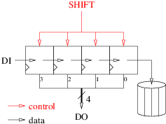

<!-- vim: set textwidth=0: -->

# Shift register

Shift registers are a very common hardware element that can be found in many designs. This exercise consists in designing one.

## Interface

Create a file named `sr.vhd` in your personal subdirectory of `20170427_exercises`, put the necessary library and packages-use declarations and design a entity named `sr` (for Shift Register) with the following input-output ports:

| Name       | Type                            | Direction | Description                                                             |
| :----      | :----                           | :----     | :----                                                                   |
| `clk`      | `std_ulogic`                    | in        | Master clock. The design is synchronized on the rising edge of `clk`.   |
| `sresetn`  | `std_ulogic`                    | in        | *Synchronous*, active low reset.                                        |
| `shift`    | `std_ulogic`                    | in        | Shift command input. The register shifts when `shift` is asserted high. |
| `di`       | `std_ulogic`                    | in        | Serial input of the shift register.                                     |
| `do`       | `std_ulogic_vector(3 downto 0)` | out       | Current value of the shift register.                                    |

## Architecture

In the same VHDL source file add an architecture named `arc` that:

* Uses `clk` as its master clock. The design is synchronized on the rising edge of `clk`.
* Contains a 4-bits internal register named `reg`.
* Uses `sresetn` as its *synchronous*, active low reset to force `reg` to all-zeroes.
* Sends `reg` to `do`.
* Shifts `reg` by one position to the right each time the `shift` signal is asserted high on a rising edge of `clk` (and `sresetn` is not active). The leftmost entering bit is `di`. The rightmost leaving bit is lost.



## Compilation

Check (at least) that your design compiles:

### With `ghdl`:

```bash
cd $o
ghdl -a --std=08 $r/sr.vhd
cd $r
```

### With Modelsim:

```bash
cd $o
vcom -novopt -2008 $r/sr.vhd
cd $r
```

If it compiles you can add-commit-push, let me know and wait until you receive the email with the result of the automatic evaluation (see the **Commit** section below). But of course, it would be much better if you were validating your design yourself with your own simulation environment (see the **Simulation** section below) before pushing.

## Simulation

Create a file named `sr_sim.vhd` in your personal subdirectory containing `sr_sim.sim`, the VHDL model of a simulation environment for `sr.arc`. Compile and simulate your design:

### With `ghdl` and `gtkwave`:

```bash
cd $o
ghdl -a --std=08 $r/sr.vhd $r/sr_sim.vhd
ghdl -e --std=08 sr_sim
./sr_sim --vcd=- | gtkwave --vcd
cd $r
```

### With Modelsim:

```bash
cd $o
vcom -novopt -2008 $r/sr.vhd $r/sr_sim.vhd
vsim -novopt sr_sim
cd $r
```

## Commit

As soon as you are satisfied with the results, and before the time limit, commit your work:

```
cd $r
n=sr.vhd
git add $n; git commit -m 'Add $n'; git pull; git push
```

(to reduce the risk of collisions with others, copy paste the complete `git...` command line and execute the 4 `git` commands at once).

## Peer review

Discuss your solution with your neighbour. Have a look at mine. Ask questions.


## Data Selector

data selector/multiplexer A logic circuit that may be considered as a single-pole multiway switch whose output is determined by the position of the switch wiper (see diagram). The wiper position is controlled by a select signal, normally digital, that indicates which of the inputs is to be connected to the output. In this way a number of channels of data may be placed sequentially on a time-shared output bus under the control of the select signal, a process known as time-division multiplexing. Inputs to and outputs from a multiplexer may be in digital or analog form. See also decoder/demultiplexer.
