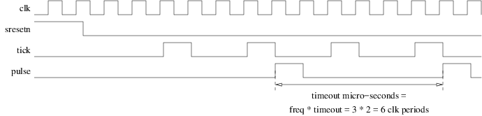

<!-- vim: set textwidth=0: -->

# Timer

Measuring time is sometimes useful. In this exercise we will design a two-stages synchronous counter. The first stage will run at full clock speed and produce a tick every micro-second. The second one will count at the tick rate and thus count micro-seconds.

## Interface

Create a file named `timer.vhd` in your personal subdirectory of `20170427_exercises`, put the necessary library and packages-use declarations and design a entity named `timer` with the following generic parameters:

| Name       | Type                            | Description                                                         |
| :----      | :----                           | :----                                                               |
| `freq`     | `positive range 1 to 1000`      | Master clock frequency in MHz (also clock periods per micro-second) |
| `timeout`  | `positive range 1 to 1000000`   | Number of micro-seconds between two output pulses                   |

... and the following input-output ports:

| Name       | Type         | Direction | Description                                                              |
| :----      | :----        | :----     | :----                                                                    |
| `clk`      | `std_ulogic` | in        | Master clock. The design is synchronized on the rising edge of `clk`     |
| `sresetn`  | `std_ulogic` | in        | *Synchronous*, active low reset                                          |
| `pulse`    | `std_ulogic` | out       | Asserted high for one `clk` clock period every `timeout` micro-seconds   |

## Architecture

In the same VHDL source file add a fully combinatorial architecture named `arc` that:

* Uses `clk` as its master clock. The design is synchronized on the rising edge of `clk`.
* Contains a first counter:
    * which reset value is `freq-1`,
    * that decrements at `clk` clock frequency,
    * that wraps around 0 and restarts at value `freq-1`,
    * that asserts an internal `std_ulogic` signal named `tick`, during one `clk` clock period, every time it wraps, that is, when it transitions from 0 to `freq-1`,
* Contains a second counter:
    * which reset value is `timeout-1`,
    * that decrements on `clk` rising edges when `tick` is asserted,
    * that wraps around 0 and restarts at value `timeout-1`,
    * that asserts the `pulse` output, during one `clk` clock period, every time it wraps.
* Uses `sresetn` as its *synchronous*, active low reset to force the two counters to their reset values.

The `pulse` output shall thus be periodic and its period shall be `timeout` micro-seconds. The figure below represents the `clk`, `sresetn`, `tick` and `pulse` signals for `freq=3` and `timeout=2`.



## Compilation

Check (at least) that your design compiles:

### With `ghdl`:

```bash
cd $o
ghdl -a --std=08 $r/timer.vhd
cd $r
```

### With Modelsim:

```bash
cd $o
vcom -novopt -2008 $r/timer.vhd
cd $r
```

If it compiles you can add-commit-push, let me know and wait until you receive the email with the result of the automatic evaluation (see the **Commit** section below). But of course, it would be much better if you were validating your design yourself with your own simulation environment (see the **Simulation** section below) before pushing.

## Simulation

Create a file named `timer_sim.vhd` in your personal subdirectory containing `timer_sim.sim`, the VHDL model of a simulation environment for `timer.arc`. Compile and simulate your design (in order to have reasonable simulation times, set the generic parameters to small values):

### With `ghdl` and `gtkwave`:

```bash
cd $o
ghdl -a --std=08 $r/timer.vhd $r/timer_sim.vhd
ghdl -e --std=08 timer_sim
./timer_sim --vcd=- | gtkwave --vcd
cd $r
```

### With Modelsim:

```bash
cd $o
vcom -novopt -2008 $r/timer.vhd $r/timer_sim.vhd
vsim -novopt timer_sim
cd $r
```

## Commit

As soon as you are satisfied with the results, and before the time limit, commit your work:

```
cd $r
n=timer.vhd
git add $n; git commit -m 'Add $n'; git pull; git push
```

(to reduce the risk of collisions with others, copy paste the complete `git...` command line and execute the 4 `git` commands at once).

## Peer review

Discuss your solution with your neighbour. Have a look at mine. Ask questions.

