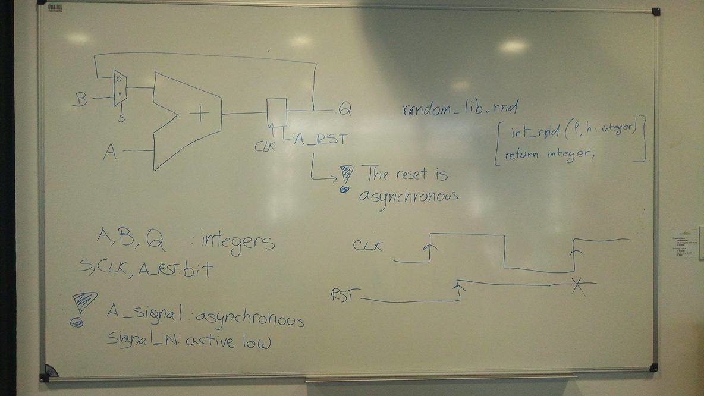

<!-- vim: set textwidth=0: -->
# Digital Systems course git repository, year 2017

----

## News

----

### 2017-06-23: PhD position at ETIS lab of Cergy-Pontoise University

[ETIS] has a [PhD position available](https://gitlab.eurecom.fr/renaud.pacalet/ds-2017/raw/master/doc/20170623_ETIS_PhD2.pdf) about Networks-on-a-Chip (NoC). Very good match with this course.

----

### 2017-04-06: PhD position at [LIRMM](http://www.lirmm.fr/

[LIRMM] has a [PhD position available](https://gitlab.eurecom.fr/renaud.pacalet/ds-2017/raw/master/doc/In-Memory%20Computing%20for%20Homomorphic%20Encryption.pdf) about security, in-memory computing, homomorphic encryption. Very good match with this course.

----

### 2017-04-06: Final evaluation

The final evaluation will be based on 3 activities:
* Written exam, one hour, with all documents (some questions and a small exercise, e.g. some VHDL coding): 30% of final grade.
* SO contributions (same grade for all team members): 30%.
* DHT11 project (same grade for all team members): 40%.

----

### 2017-03-31: Internship position at Mentor Graphics Munich (Germany)

Mentor Graphics (the vendor of the Modelsim VHDL simulator we use) offers an intern position at its Munich (Germany) office. The internship is planned for 6 months and should start as soon as the student is available. Please see the [description](https://gitlab.eurecom.fr/renaud.pacalet/ds-2017/raw/2b043021bae373379065889525488a5ac786bcdf/doc/mentor_internship.pdf) and, if you are interested, let me (Renaud Pacalet) know.

Notes: HLS stands for High Level Synthesis, an emerging technique that generates VHDL (or Verilog) from C/C++ descriptions. Catapult is the HLS tool by Mentor Graphics. 5G is the fifth generation of wireless digital communications.

----

## [Frequently Asked Questions (FAQ)](./doc/FAQ.md)

----

## [Assignments](#assignments)

* [For 2017/06/20](#assignments20170620)
* [For 2017/06/08](#assignments20170608)
* [For 2017/06/01](#assignments20170601)
* [For 2017/05/11](#assignments20170511)
* [For 2017/05/04](#assignments20170504)
* [For 2017/04/27](#assignments20170427)
* [For 2017/04/13](#assignments20170413)
* [For 2017/04/06](#assignments20170406)
* [For 2017/03/30](#assignments20170330)
* [For 2017/03/23](#assignments20170323)
* [For 2017/03/16](#assignments20170316)

----

## [Sessions](#sessions)

* [2017/06/08](#sessions20170608)
* [2017/06/01](#sessions20170601)
* [2017/05/18](#sessions20170518)
* [2017/05/11](#sessions20170511)
* [2017/05/04](#sessions20170504)
* [2017/04/27](#sessions20170427)
* [2017/04/13](#sessions20170413)
* [2017/04/06](#sessions20170406)
* [2017/03/30](#sessions20170330)
* [2017/03/23](#sessions20170323)
* [2017/03/16](#sessions20170316)
* [2017/03/09](#sessions20170309)

----

## <a name="assignments"></a>Assignments

----

### <a name="assignments20170620"></a>For 2017/06/20

Before the written exam, that is, not later than the 26th of June, 09:30, please:

1. Return the Zybo in its plastic bag, with all parts. Most of the time, I am in my office (473). In case I am not, please give the bag to one of my colleagues (offices 463, 465, 467, 469, 471 and 470). Please check that you return all parts:
    * 1 Zybo board in its cardbox with a pink foam slab and with its 3 blue jumpers. Please check that the 3 jumpers are plugged on their respective connectors and in the following positions:
        - Power source selector: USB
        - USB OTG selector: HOST
        - Boot medium selector: SD
    * 1 DHT11 sensor in its cardbox, with its male-female wire.
    * 1 Ethernet cable.
    * 1 USB - micro USB cable.
    * 1 micro SD card, with its SD card adapter and plastic package. Please remove the micro SD card from the Zybo slot, insert it in its SD card adapter and put the SD card adapter in its plastic package.
    * 1 plastic bag with a zip. Please put all parts in the bag and close it.
1. Finalize your SO contrinution. Please do not forget to list the contributors.
1. Finalize your DHT11 code and documentation (in `dht11/FirstLast/REAME.md`). Please do not forget to list the contributors.
1. Prepare the written exam:
    * review the coding challenges,
    * review the *Learn a bit more of VHDL* sections,
    * review the [Free Range Factory] book,
    * if needed, ask questions (by e-mail or face-to-face).

The 26th of June at 09:30, I will close the `ds-2017` git repository and start evaluating all your contributions. If you want to keep track of all we did together, please pull before I close the repository. After that, it will not be accessible any more. Not even for reading.

----

### <a name="assignments20170608"></a>For 2017/06/08

Same as [assignment for 2017/06/01](#assignments20170601)

----

### <a name="assignments20170601"></a>For 2017/06/01

* Complete the [AXI lite] version of DHT11 controller.
* Finalize the technical documentation of your work in the `dht11/FirstLast/README.md` file.
* In order to prepare the written exam:
    * review the coding challenges,
    * review the *Learn a bit more of VHDL* sections,
    * review the [Free Range Factory] book,
    * prepare questions.

----

### <a name="assignments20170601"></a>For 2017/06/01

* Finalize SO contributions.
* Complete standalone version DHT11 controller.
* Design the [AXI lite] version of DHT11 controller.
* Add the technical documentation of your work in the `dht11/FirstLast/README.md` file.
* In order to prepare the written exam:
    * review the coding challenges,
    * review the *Learn a bit more of VHDL* sections,
    * review the [Free Range Factory] book,
    * prepare questions.

----

### <a name="assignments20170511"></a>For 2017/05/11

* Take open issues into account for SO contributions, continue improving your contributions. **All team members shall be involved**.
* Continue coding your DHT11 controller in your own sub-directory in `dht11`. Do not forget to design a technical documentation of your work in the `README.md` file (see the `dht11/RenaudPacalet/README.md` example).
* Visit the [AMBA 4 protocol web page][AXI lite] on the ARM website, download the *AXI4-Lite Specification* (register if you do not have an account already), study and understand the AXI4-lite protocol. It is the communication protocol we will be using between the ARM processor of the Zynq core of the Zybo board and the DHT11 controller mapped in the programmable logic of the Zynq.
* Imagine how you will extend your DHT11 controller to interface it with the ARM processor of the Zynq core of the Zybo board, using the AXI4-lite protocol.

----

### <a name="assignments20170504"></a>For 2017/05/04

* All: come with a joint agreement on the course evaluation. Marco collects opinions and final decision.
* Complete the SR, TIMER and LB coding challenges.
* Read chapter 11 (Looping Constructs) of the [Free Range Factory] book.
* Read chapter 12 (Standard Digital Circuits in VHDL) of the [Free Range Factory] book.
* Take open issues into account for SO contributions, continue improving your contributions. **All team members shall be involved**.
* Continue coding your DHT11 controller in your own sub-directory in `dht11`. Do not forget to design a technical documentation of your work in the `README.md` file (see the `dht11/RenaudPacalet/README.md` example).

----

### <a name="assignments20170427"></a>For 2017/04/27

* Imagine how you would like to be evaluated and graded for the DigitalDesign course.
* Take open issues into account for SO contributions, continue improving your contributions. **All team members shall be involved**.
* Read second part of chapter 6 (VHDL Operators) of the [Free Range Factory] book.
* Read chapter 7 (Finite State Machine Design Using VHDL) of the [Free Range Factory] book.
* Start coding your DHT11 controller in your own sub-directory in `dht11`. Do not forget to design a technical documentation of your work in the `README.md` file (see the `dht11/RenaudPacalet/README.md` example).

----

### <a name="assignments20170413"></a>For 2017/04/13

* Take open issues into account for SO contributions.
* Take a look at the [Zybo reference manual] (also in `doc/zybo_rm.pdf`) and the [Zybo schematics] (also in `doc/zybo_sch.pdf`) of the Zybo, identify FPGA I/Os for the DHT11 and their power supply voltage:
    * data (standard Pmod connector JE), power, ground, imagine how to plug the DHT11 sensor,
    * slide switches,
    * LEDs,
    * press button
* Read first part on operators of chapter 6 (VHDL Operators) of the [Free Range Factory] book.
* Read chapter 10 (Data Objects) of the [Free Range Factory] book.
* Add your own sub-directory in `dht11` and put a `README.md` file in it (see the `dht11/RenaudPacalet/README.md` example).

----

### <a name="assignments20170406"></a>For 2017/04/06

* Continue SO contributions
* Review others' SO contributions, improve or suggest improvements
* Read the [datasheet of the DHT11 temperature and humidity sensor] (also in `doc/DHT11.pdf`) and the [specifications](doc/dht11.md) of the dht11 controller to design (in `doc/dht11.md`). Design a complete block diagram of the dht11 controller according method described in the [Digital hardware design using VHDL in a nutshell](http://stackoverflow.com/documentation/vhdl/5525/digital-hardware-design-using-vhdl-in-a-nutshell#t=201703300922036928479) topic of [SO VHDL documentation](http://stackoverflow.com/documentation/vhdl/topics). Specify behaviour of each block.

----

### <a name="assignments20170330"></a>For 2017/03/30

* Bring your boards
* Continue SO contributions
* Review others' SO contributions, improve or suggest improvements
* Read the [datasheet of the DHT11 temperature and humidity sensor] (also in `doc/DHT11.pdf`). Imagine a digital hardware interface to communicate with it, that is, some digital circuit that implements the communication protocol and outputs the read temperature and humidity level.

----

### <a name="assignments20170323"></a>For 2017/03/23

* Continue learning `git` and Markdown
* Continue learning VHDL with the [Free Range Factory] book and the [VHDL documentation on SO].
* Start writing your SO contribution (in Markdown syntax). Put it in the `doc` subdirectory of our git repository, name it `SO-<title>.md` where `<title>` is some meaningful short description of the topic you selected. When satisfied with a first version, commit your work:
```
cd ds-2017
git pull
git add doc/SO-<title>.md
git commit -m 'Add first version of doc/SO-<title>.md'
git push
```

* Finish the VHDL model of the accumulator and validate it by simulation. Name your source file `<first-name>_accumulator.vhd` where `<first-name>` is... your first name and put it in `accumulator/`. Commit and push it:
```
cd ds-2017
git pull
git add accumulator/<first-name>_accumulator.vhd
git commit -m 'Add accumulator/<first-name>_accumulator.vhd'
git push
```

* Read the datasheet of the DHT11 temperature and humidity sensor in `doc/DHT11.pdf`. Imagine a digital hardware interface to communicate with it, that is, some digital circuit that implements the communication protocol and outputs the read temperature and humidity level.

----

### <a name="assignments20170316"></a>For 2017/03/16

* Learn a bit of `git` (e.g. look at the [ProGit book]:
  * clone
  * pull
  * push
  * commit
  * checkout
  * status
* Learn a bit of Markdown (e.g. look at [Daring Fireball] or [Markdown tutorial]).
* Visit the [Free Range Factory] web site and get your own PDF copy of their VHDL book. Start reading it and understand the VHDL statements that we used during the last session.
* Continue exploring the [VHDL documentation on SO]
* Start writing your SO contribution (in Markdown syntax).

----

## <a name="sessions"></a>Sessions

----

### <a name="sessions20170608"></a>2017/06/08

Documentation:
* [Datasheet of the DHT11 temperature and humidity sensor] (also in `doc/DHT11.pdf`).
* [Specifications](doc/dht11.md) of the dht11 controller to design (also in `doc/dht11.md`).
* The VHDL templates are in `dht11/RenaudPacalet`. Complete `dht11_axi.vhd`. Do not change the entity, just populate the architecture.

#### Complete validation of AXI version of DHT11 controllers

The simulation environment is in `dht11/RenaudPacalet/dht11_axi_sim.vhd`:

```bash
cd <some-where>/ds-2017/dht11/<first>.<last>
r=$(pwd)
cd ../RenaudPacalet
cp dht11_axi_sim.vhd $r
o=/tmp/build.$USER/sim
mkdir -p $o
cd $o
export PATH=$PATH:/packages/LabSoC/Mentor/Modelsim/bin
vlib work
vmap work work
vcom -ignoredefaultbinding -nologo -quiet -2008 $r/axi_pkg.vhd
vcom -ignoredefaultbinding -nologo -quiet -2008 $r/dht11_pkg.vhd
# compile all other source files your dht11_ctrl depends on
vcom -ignoredefaultbinding -nologo -quiet -2008 $r/dht11_ctrl.vhd
# compile all other source files your dht11_axi depends on
vcom -ignoredefaultbinding -nologo -quiet -2008 $r/dht11_axi.vhd
vcom -ignoredefaultbinding -nologo -quiet -2008 $r/dht11_axi_sim.vhd
vsim -voptargs="+acc" dht11_axi_sim
```

#### Complete synthesis and on-board testing of AXI versions of DHT11 controllers

Copy the synthesis scripts and the very last version of the AXI VHDL wrappers in your personal subdirectory of `dht11`:

```bash
cd <some-where>/ds-2017/dht11/<first>.<last>
r=$(pwd)
cd ../RenaudPacalet
cp dht11_axi_top.syn.tcl load_vhdl_axi.tcl boot.bif dht11_pkg_syn.vhd dht11_axi_top.vhd $r
```

Note: the `dht11_pkg_syn.vhd` is a VHDL 2002 compatible version of `dht11_pkg.vhd`. It is this version that we must use for synthesis because the synthesis tool does not fully support VHDL 2008.

Edit the `load_vhdl_axi.tcl` script and adapt the list of VHDL source files to your own project organization. Prepare your PATH environment variable for the Xilinx tools, create a temporary directory for your synthesis, assign a shell variable `p` pointing to this temporary directory and launch your first synthesis:

```bash
export PATH=$PATH:/packages/LabSoC/Xilinx/bin
p=/tmp/build.$USER/syn
mkdir -p $p
cd $p
vivado -mode batch -source $r/dht11_axi_top.syn.tcl -notrace -tclargs $r
```

If the synthesis completes without errors, check the resource utilization report (`top.runs/impl_1/top_wrapper_utilization_placed.rpt`) and the timing report (`top.runs/impl_1/top_wrapper_timing_summary_routed.rpt`). If they look OK, generate the boot image:

```bash
bootgen -w -image $r/boot.bif -o boot.bin
```

You are now ready to test your design on the board. The synthesis script binds the data line of the sensor to pin number 1 of the `JE` Pmod connector (look at pages 24 and 25 of the [Zybo reference manual] to make sure you understand what it is). To communicate with the sensor from the software world, simply use the `devmem` utility and read (or write) at various locations. The base address of the DHT11 AXI controller is `0x4000_0000`. Example:

```bash
zybo> devmem 0x40000000 32 # read temperature and humidity level
zybo> devmem 0x40000004 32 # read status (00...00 | PE | B | CE)
zybo> devmem 0x40000008 32 # read out of range, should raise error
zybo> devmem 0x40000000 32 0 # write in range, should raise error
zybo> devmem 0x40000004 32 0 # write in range, should raise error
zybo> devmem 0x40000008 32 0 # write out of range, should raise error
```

A more user-friendly solution would be to use a small shell script, like, for instance:

```sh
#!/usr/bin/env sh

tmp=$(devmem 0x40000000)
h=$((tmp >> 24))
t=$(((tmp >> 8) & 0xff))
printf "H: %d%%\nT: %d°C\n" $h $t
exit 0
```

Copy it from `ds-2017/dht11/RenaudPacalet/ht1.sh` to your SD card and boot the Zybo board. Mount the SD card and run the script:

```sh
Sab4z> mount /dev/mmcblk0p1 /mnt
Sab4z> /mnt/ht1.sh
```

There are several drawbacks to this `devmem`-based approach:
* The `devmem` utility is not always available,
* Even when available, the `devmem` utility cannot be run by regular users. Because it allows direct access to any memory location through its physical address, it is a serious security issue, and its use is reserved to the privileged users.

On our Zybo board we are running a Busybox/Linux operating system that supports `devmem`, and we are root. But on other systems things could be different...

A much better way would be to design a software driver for our DHT11 controller. Thanks to this, the Linux kernel would be in charge of our hardware peripheral, like for all other peripherals. It would allow to access the DHT11 controller as a regular user, without `devmem`, and without referring to physical addresses. Interested? Attend the [Operating Systems course].

----

### <a name="sessions20170601"></a>2017/06/01

Documentation:
* [Datasheet of the DHT11 temperature and humidity sensor] (also in `doc/DHT11.pdf`).
* [Specifications](doc/dht11.md) of the dht11 controller to design (also in `doc/dht11.md`).
* The VHDL templates are in `dht11/RenaudPacalet`. Complete `dht11_ctrl.vhd` and `dht11_sa.vhd`. Do not change the entities, just populate the architectures. Remember that the `do` output of `dht11_ctrl` must be kept stable until a new 40 bits data block is ready.

#### Complete validation of DHT11 controllers

#### Complete synthesis and on-board testing of standalone versions of DHT11 controllers

Copy the synthesis scripts and the very last version of the VHDL wrappers in your personal subdirectory of `dht11`:

```bash
cd <some-where>/ds-2017/dht11/<first>.<last>
r=$(pwd)
cd ../RenaudPacalet
cp dht11_sa_top.syn.tcl load_vhdl.tcl boot.bif dht11_pkg_syn.vhd dht11_sa_top.vhd $r
```

Note: the `dht11_pkg_syn.vhd` is a VHDL 2002 compatible version of `dht11_pkg.vhd`. It is this version that we must use for synthesis because the synthesis tool does not fully support VHDL 2008.

Edit the `load_vhdl.tcl` script and adapt the list of VHDL source files to your own project organization. Prepare your PATH environment variable for the Xilinx tools, create a temporary directory for your synthesis, assign a shell variable `p` pointing to this temporary directory and launch your first synthesis:

```bash
export PATH=$PATH:/packages/LabSoC/Xilinx/bin
p=/tmp/build.$USER/syn
mkdir -p $p
cd $p
vivado -mode batch -source $r/dht11_sa_top.syn.tcl -notrace -tclargs $r
```

If the synthesis completes without errors, check the resource utilization report (`top.runs/impl_1/top_wrapper_utilization_placed.rpt`) and the timing report (`top.runs/impl_1/top_wrapper_timing_summary_routed.rpt`). If they look OK, generate the boot image:

```bash
bootgen -w -image $r/boot.bif -o boot.bin
```

You are now ready to test your design on the board. The synthesis script binds the data line of the sensor to pin number 1 of the `JE` Pmod connector (look at pages 24 and 25 of the [Zybo reference manual] to make sure you understand what it is). The reset is bound to press button 0 (`btn0`) and the start command is bound to press button 1 (`btn1`).

----

### <a name="sessions20170518"></a>2017/05/18

#### Christian presentation of AXI protocol

#### Specify functional verification environment for DHT11 controller

#### VHDL coding of DHT11 controllers

Documentation:
* [Datasheet of the DHT11 temperature and humidity sensor] (also in `doc/DHT11.pdf`).
* [Specifications](doc/dht11.md) of the dht11 controller to design (also in `doc/dht11.md`).
* The VHDL templates are in `dht11/RenaudPacalet`. Complete `dht11_ctrl.vhd` and `dht11_sa.vhd`. Do not change the entities, just populate the architectures. Remember that the `do` output of `dht11_ctrl` must be kept stable until a new 40 bits data block is ready.

#### Design reviews (10 minutes per team)

----

### <a name="sessions20170511"></a>2017/05/11

#### Complete the SR, TIMER, LB and SM coding challenges

#### VHDL coding of DHT11 controllers

Documentation:
* [Datasheet of the DHT11 temperature and humidity sensor] (also in `doc/DHT11.pdf`).
* [Specifications](doc/dht11.md) of the dht11 controller to design (also in `doc/dht11.md`).

Advices:
* Start by designing the state diagram of the main finite state machine that will control everything.
* Ignore error conditions at the beginning. You will add them later.
* Use the timer from the coding challenge (after, maybe, adapting it to your needs) to count microseconds.
* Use the shift register from the coding challenge (after adapting it to your needs) to store the received bits, including the parity check byte.

#### Specify functional verification environment for DHT11 controller

----

### <a name="sessions20170504"></a>2017/05/04

#### Discussion on course evaluation

#### Multiple clock domains and re-synchronization

#### Coding challenges

Work in your personal subdirectory of `20170504_exercises`. It already exists and contains a copy of the `id.mk` file from last time. Like last time, define shell variables, create temporary directories for your compilations and simulations, prepare your `PATH` environment variable to use Modelsim or ghdl...

1. [State machine](20170504_exercises/sm.md): 20 minutes

#### Complete the SR, TIMER and LB coding challenges

#### Learn a bit more of VHDL

What do you want to learn? What do you need for your DHT11 project?

#### Specify functional verification environment for DHT11 controller

#### VHDL coding of DHT11 controllers

----

### <a name="sessions20170427"></a>2017/04/27

#### Coding challenges

Do not worry, your scores are informative only. They will not be taken into account for the final grade. But please take this opportunity to check your VHDL understanding and skills...

Like last time, in order to separate your own work from that of others, create a subdirectory of `20170427_exercises`, define the shell variable `r`, copy the `id.mk` file from last time and add-commit-push:

```bash
cd <some-where>/ds-2017/20170427_exercises
mkdir <first>.<last>
cd <first>.<last>
r=$(pwd)
cp ../20170413_exercises/<first>.<last>/id.mk .
n=id.mk
git add $n; git commit -m 'Create personal directory'; git pull; git push
```

Prepare also a temporary directory for your compilations and simulations and assign the shell variable `o`:

```bash
o=/tmp/build.$USER/sim
mkdir -p $o
```

If you intend to compile and simulate with Modelsim, prepare also your `PATH` environment variable and the target `work` library in `$o`:

```bash
export PATH=$PATH:/packages/LabSoC/Mentor/Modelsim/bin
cd $o
vlib work
vmap work work
cd $r
```

Prepare another temporary directory for your synthesis, assign the shell variable `p` and prepare your `PATH` environment variable for the Xilinx tools:

```bash
export PATH=$PATH:/packages/LabSoC/Xilinx/bin
p=/tmp/build.$USER/syn
mkdir -p $p
```

In the directions of the challenges we will refer to the `r`, `o` and `p` shell variables. Make sure they are always properly defined, especially if you spawn a new shell. Same for the `PATH` environment variable for Modelsim and Xilinx tools. Just to be sure, it could be a good idea to put the following commands in a `~/.dsrc` file:

```bash
r=<some-where>/ds-2017/20170427_exercises/<first>.<last>
o=/tmp/build.$USER/sim
p=/tmp/build.$USER/syn
export PATH=$PATH:/packages/LabSoC/Mentor/Modelsim/bin
export PATH=$PATH:/packages/LabSoC/Xilinx/bin
```

and to *source* it each time you launch a new shell:

```bash
source ~/.dsrc
```

You are now ready for the challenges. The indicated times are for the design of the hardware only, not for the design of the simulation environment, the simulation, the synthesis and the test on the Zybo, if any.

1. [Shift register](20170427_exercises/sr.md): 15 minutes 
1. [Timer](20170427_exercises/timer.md): 15 minutes 
1. [LED blinking](20170427_exercises/lb.md): 15 minutes

#### Learn a bit more of VHDL

##### Aggregate notation

```vhdl
constant NREGS: positive := 32;
constant PDEPTH: positive := 7;
type codeop is (add, sub, mul, div, nop);
type instruction is record
  op:  codeop;
  rs1: natural range 0 to NREGS;
  rs2: natural range 0 to NREGS;
  rd:  natural range 0 to NREGS;
end record;
type pipeline is array(1 to PDEPTH) of instruction;
-- ...
variable i: instruction;
variable p: pipeline;
variable v: std_ulogic_vector(19 downto 5);
i := (op => nop, others => 0);
p := (others => (nop, others => 0));
v := (others => '1');
-- ...
i := (op => mul, rd => 1, others => 2);
p := (1 => (add, 1, 2, 3), others => (nop, others => 0));
v := (18 => '0', 8 downto 6 => '1', 12 | 13 => '1', others => 'X');
-- ...
i := (sub, 12, rd => 14, rs2 => 13); -- ALLOWED
-- p := ((mul, 3, 4, 5), 3 => (add, 1, 2, 3), others => (nop, others => 0)); -- FORBIDDEN
-- v := ('1', '0', '1', 7 => '0', others => '1'); -- FORBIDDEN
-- ...
-- i := (rs1 => 7, 12, others => 0); -- FORBIDDEN
```

##### Bit slicing, concatenation

```vhdl
variable a: std_ulogic_vector(3 to 9);
variable b: std_ulogic_vector(34 downto 16);
variable c: std_ulogic;
...
b := "0101" & a & a & '1';
b(21 downto 17) := a(4 to 8);
a := c & a(3 to 8);
b := a(4) & b(20 downto 16) & x"f4a" & c;
c := b(30);
```

##### Finite state machines

* What are Moore and Mealy state machines?
* Draw a block diagram of both types.
* In VHDL2008, what is the minimum number of processes to model a Moore state machine? And Mealy? And with older versions of VHDL?

#### VHDL coding of DHT11 controllers

#### Specify functional verification environment for DHT11 controller

#### Discussion on course evaluation

----

### <a name="sessions20170413"></a>2017/04/13

#### Coding challenges

This is a short series of simple coding exercises that you will have to solve in less than a given time. Do not worry, your scores are informative only. They will not be taken into account for the final grade. But please take this opportunity to check your VHDL understanding and skills...

In order to separate your own work from that of others, create a subdirectory of `20170413_exercises`:

```bash
cd <some-where>/ds-2017/20170413_exercises
mkdir <first>.<last>
cd <first>.<last>
r=$(pwd)
```

From now on, we will use the `$r` value of shell variable `r` to refer to your personal directory. Please remember that and redefine it each time you spawn a new shell.

The automtic evaluation system needs few information about you. Please copy the `id.mk` file in your personal directory, edit it with your preferred editor and fill the form:

```bash
cd $r
cp ../id.mk .
vim id.mk
```

Example of filled form (please note the double quotes around first and last names):

```
first = "Renaud"
last  = "Pacalet"
email = renaud.pacalet@telecom-paristech.fr
```

Finally, commit and wait until everybody is ready (help others if needed):

```
cd $r
n=id.mk
git add $n; git commit -m 'Create personal directory'; git pull; git push
```

(to reduce the risk of collisions with others, copy paste the complete `git...` command line and execute the 4 `git` commands at once). Note the use of a second shell variable (`n`): it is convenient when a complex command will be repeated with almost the same parameters (and this one will be). It allows to update just the variable definition and use the history (up arrow) to recall the complex command.

1. [Continuity test](20170413_exercises/ct.md): 20 minutes (excluding synthesis and test on the Zybo)

#### Learn a bit more of VHDL

##### Type conversions:

```vhdl
library ieee;
use ieee.std_logic_1164.all;
use ieee.numeric_std.all;
...
signal i: integer range 0 to 255;
signal r: real;
signal v: std_ulogic_vector(7 downto 0);
signal u: u_unsigned(7 downto 0);
...
i <= integer(r);
...
r <= real(i);
...
v <= std_ulogic_vector(u);
...
u <= u_unsigned(v);
...
i <= to_integer(u);
...
u <= to_unsigned(i, 8);
...
u <= to_unsigned(i, u);
```

##### Integer types vs. vector types

```vhdl
library ieee;
use ieee.std_logic_1164.all;
use ieee.numeric_std.all;
...
signal i: integer range 0 to 255;
signal v: std_ulogic_vector(7 downto 0);
signal u: u_unsigned(7 downto 0);
```

Which one is the "*best*"?

##### Generics

Generics are a way to parametrize an entity/architecture pair. The generic parameters are declared in the entity and can be used as constants everywhere else in the entity and architecture code. They can have a default value or not and their value can be assigned when instantiating the entity inside an encapsulating design. See the following example.

##### Entity instantiation

```vhdl
entity subcircuit is
  generic(
    size: positive := 16
  );
  port(
    a: in  std_ulogic;
    b: in  std_ulogic_vector(1 to size);
    ...
    r: out std_ulogic;
    s: out std_ulogic_vector(7 downto 4)
  );
end entity subcircuit;

architecture arc of subcircuit is
...
end architecture arc;
...
entity circuit is
  port(
    a: in  std_ulogic;
    ...
    foo: out std_ulogic_vector(3 downto 0);
    ...
  );
end entity circuit;

architecture arc of circuit is
  ...
  signal bb:  std_ulogic_vector(36 downto 0);
  ...
begin
  ...
  u0: entity work.subcircuit(arc)
    generic map(
      size => 37
    )
    port map(
      a => a,
      b => bb,
      ...
      r => open,
      s => foo
    );
  ...
end architecture arc;
```

##### Random numbers generation

Random numbers generation is frequently handy in simulation environments. In VHDL2008 the `ieee.math_real` package provides a uniform pseudo-random generator. Its declaration is (from the 1076-2008 IEEE standard):

```vhdl
procedure UNIFORM(variable SEED1, SEED2 : inout POSITIVE; variable X : out REAL);
-- Purpose:
--         Returns, in X, a pseudo-random number with uniform
--         distribution in the open interval (0.0, 1.0).
-- Special values:
--         None
-- Domain:
--         1 <= SEED1 <= 2147483562; 1 <= SEED2 <= 2147483398
-- Error conditions:
--         Error if SEED1 or SEED2 outside of valid domain
-- Range:
--         0.0 < X < 1.0
-- Notes:
--         a) The semantics for this function are described by the
--            algorithm published by Pierre L'Ecuyer in "Communications
--            of the ACM," vol. 31, no. 6, June 1988, pp. 742-774.
--            The algorithm is based on the combination of two
--            multiplicative linear congruential generators for 32-bit
--            platforms.
--
--         b) Before the first call to UNIFORM, the seed values
--            (SEED1, SEED2) have to be initialized to values in the range
--            [1, 2147483562] and [1, 2147483398] respectively.  The
--            seed values are modified after each call to UNIFORM.
--
--         c) This random number generator is portable for 32-bit
--            computers, and it has a period of ~2.30584*(10**18) for each
--            set of seed values.
--
--         d) For information on spectral tests for the algorithm, refer
--            to the L'Ecuyer article.
```

#### VHDL coding of DHT11 controllers

#### Specify functional verification environment for DHT11 controller

----

### <a name="sessions20170406"></a>2017/04/06

#### Peer review of block diagrams of DHT11 controllers

#### Specify functional verification environment

#### Learn a bit more of VHDL

* Types (records, arrays, enumerated)
* The `ieee.std_logic_1164` package, the `std_ulogic_vector` and `std_logic_vector` types
* The Arithmetic packages (`ieee.numeric_bit`, `ieee.numeric_std`)
* Type conversions

#### VHDL coding of DHT11 controllers

----

### <a name="sessions20170330"></a>2017/03/30

#### Experiments with the SAB4Z example design

* Read *Description* and *Quick start* sections of [Github repository](https://github.com/pacalet/sab4z) or [Gitlab repository](https://gitlab.telecom-paristech.fr/renaud.pacalet/sab4z).
* Configure board and play with SAB4Z.

#### Learn a bit more of VHDL

##### Understand VHDL packages for synthesis

* Resolution functions and resolved types
* Three-state buffers, 3-state signalling, VHDL modeling of bidirectionals
* The `ieee.std_logic_1164` package, the `std_ulogic` and `std_logic` types
* The Arithmetic packages (`ieee.numeric_bit`, `ieee.numeric_std`)

Example design of a one-bit communication link with pull-up:
```vhdl
library ieee;
use ieee.std_logic_1164.all;
...
entity dht11_top is
  port(...
       data:    inout std_logic;
       ...
  );
end entity dht11_top;
architecture rtl of dht11_top is
  signal data_in:  std_ulogic;
  signal data_out: std_ulogic;
  signal data_drv: std_ulogic;
  ...
begin
  data    <= data_out when data_drv = '1' else 'Z';
  data_in <= data;
  ...
end architecture rtl;
```

Simplification with pull-up resistor and *drive low protocol*:
```vhdl
library ieee;
use ieee.std_logic_1164.all;
...
entity dht11_top is
  port(...
       data:    inout std_logic;
       ...
  );
end entity dht11_top;
architecture rtl of dht11_top is
  signal data_in:  std_ulogic;
  signal data_drv: std_ulogic;
  ...
begin
  data    <= '0' when data_drv = '1' else 'H';
  data_in <= data;
  ...
end architecture rtl;
```

#### Work on DHT11

* Integration with the Zybo board
* Detailed specifications
* Common interface

----

### <a name="sessions20170323"></a>2017/03/23

#### Git good practices

* Pull before push
* Never commit generated files
* Work out of git repository to avoid adding and committing generated files
* Use symbolic links if needed
* Use `.git/info/exclude` and `.gitignore`
* Carefully review changes before committing

#### Tips and tricks

* Copy the `scripts/.inputrc` file in your home directory, launch a new shell, and benefit from a smarter history and completion (see the comments in the script).

#### Complete design and validation of accumulator

All accumulators must pass the non-regression test:
```
R=<some-path>/ds-2017/accumulator
cd $R
git pull
O=/tmp/build-<username>/simulation
mkdir -p $O
cd $O
ln -s $R/<firstname>_accumulator.vhd accumulator.vhd
cp $R/mac_tb.vhd .
vlib work
vmap work work
vcom accumulator.vhd mac_tb.vhd
vsim -c -do 'run -all; quit' mac_tb
...
# ************************************************************
# ***** SIMULATING FOR 1000000 CLOCK CYCLES. PLEASE WAIT...
# ************************************************************
# ************************************************************
# ***** NON-REGRESSION TEST PASSED. CONGRATULATIONS!
# ************************************************************
...
```

#### A bit of GNU make

```
R=<some-path>/ds-2017/accumulator
cd $R
git pull
make <first-name>_accumulator-sim
```

#### Logic synthesis of the accumulator

```
export PATH=$PATH:/packages/LabSoC/Synopsys/dc/bin
R=<some-path>/ds-2017/accumulator
cd $R
git pull
O=/tmp/build-<username>/synthesis
mkdir -p $O
cd $O
ln -s $R/<firstname>_accumulator.vhd accumulator.vhd
dc_shell -f $R/dc_setup.tcl
```

Then, under the `dc_shell>` prompt:

```
analyze -format vhdl -library work ./accumulator.vhd
elaborate accumulator
create_clock -period 10.0 clk
set_input_delay -clock clk 5.0 [all_inputs]
set_output_delay -clock clk 5.0 [all_outputs]
set_driving_cell -no_design_rule -lib_cell DFFX2_RVT [all_inputs]
set_drive 0 clk
set_load 2.0 [all_outputs]
set_max_area 10000.0
check_design
compile
report_area
report_area > accumulator.area
report_timing
report_timing > accumulator.timing
write_file -format verilog -hierarchy -output accumulator.v
write_file -format ddc -hierarchy -output accumulator.ddc accumulator
gui_start
gui_create_schematic
quit
```

* HTML report in `dc_log.html` (only after `quit`)
* Area and timing reports in `accumulator.area` and `accumulator.timing`, respectively
* Number of D-flip-flops?
* Silicon area?
* Critical path of the circuit?
* [Datasheet of the target standard cells library]

#### A bit of GNU make and TCL scripts

```
R=<some-path>/ds-2017/accumulator
cd $R
git pull
make <first-name>_accumulator-syn
```

* Verilog model of synthesized netlist in `/tmp/build-<username>/synthesis/accumulator.v`
* Reports in `/tmp/build-<username>/synthesis`

----

### <a name="sessions20170316"></a>2017/03/16

#### Frequently Asked Questions (FAQ)

It is in `doc/FAQ.md`. Everybody is kindly asked to contribute the FAQ: each time you ask a question (to the teacher or to a comrade) and get a useful answer and feel that it can be useful to the others, add an entry in the FAQ and push:
```
cd ds-2017
git pull
<edit doc/FAQ.md>
git add doc/FAQ.md
git commit -m 'Add entry about <something> to the FAQ'
git push
```

#### Simulation of the accumulator

The simulation environment designed by our validation team (thank you, guys) is in `accumulator/mac_tb.vhd`. It generates a clock at 50 MHz and assigns the other inputs with semi-random values. It also checks that the output of the accumulator is really what it should be. In case something goes wrong the simulation stops with a meaningful error message. Else, the simulation runs for 50.000.000 clock cycles (1 second) and stops with the `End of simulation, non-regression test passed` message. To simulate your design with the Modelsim GUI and visualize the waveforms of the relevant signals:
```
cd ds-2017/accumulator
vlib work
vmap work work
vcom -2008 <first-name>_accumulator.vhd mac_tb.vhd
vsim mac_tb
```

Before launching the simulation, do not forget to select the signals you want to observe and add them to the waveform display.

To simulate without the GUI (wait until the simulation ends):
```
cd ds-2017/accumulator
vlib work
vmap work work
vcom -2008 <first-name>_accumulator.vhd mac_tb.vhd
vsim -c -do 'run -all; quit' mac_tb
```

#### Improvements to the original simulation environment:

* Use `assert` to stop the simulation when the observed output is not the expected one. Comparison done on falling edges of the clock to accommodate delta-cycle shifts.
* Change value of the `S` input (was stuck at `'0'`).
* Stop simulation gracefully after one second using the `stop` procedure of the `std.env` package (VHDL2008 only).
* Instantiate an entity instead of a component in order to raise an error if the Design Under Test (DUT) is not found.

----

### <a name="sessions20170309"></a>2017/03/09

#### Modelsim setup
```
export PATH=$PATH:/packages/LabSoC/Mentor/Modelsim/bin
```

Note: add this to your `~/.bashrc` or `~/.bashrc+`:
```
echo 'export PATH=$PATH:/packages/LabSoC/Mentor/Modelsim/bin' >> ~/.bashrc
```

Then, create a library and give it a logical name:
```
vlib myLib
vmap Work myLib
```

That's it. To compile:
```
vcom foo.vhd
```

To simulate:
```
vsim foo
```
where `foo` is the name of the entity of the simulation environment.

#### First design block diagram



```vhdl
entity accumulator is
  port(
    clk:   in  bit;
    a_rst: in  bit;
    s:     in  bit;
    a:     in  integer;
    b:     in  integer;
    q:     out integer
  );
end entity accumulator;

architecture rtl of accumulator is
  signal <name>: <type>;
  signal <name>: <type>;
  ...
begin
  p1: process(...)
    variable <name>: <type>;
    ...
  begin
    ...
  end process p1;

  p2: process(...)
    ...
  begin
    ...
  end process p2;
end architecture rtl;
```

[Zybo reference manual]: https://gitlab.eurecom.fr/renaud.pacalet/ds-2017/raw/master/doc/zybo_rm.pdf
[Zybo schematics]: https://gitlab.eurecom.fr/renaud.pacalet/ds-2017/raw/master/doc/zybo_sch.pdf
[Free Range Factory]: http://freerangefactory.org/
[Daring Fireball]: https://daringfireball.net/projects/markdown/syntax
[Markdown tutorial]: http://www.markdowntutorial.com/
[ProGit book]: https://git-scm.com/book/en/v2
[VHDL documentation on SO]: http://stackoverflow.com/documentation/vhdl/topics
[LIRMM]: http://www.lirmm.fr/
[AXI lite]: https://developer.arm.com/products/architecture/amba-protocol/amba-4
[datasheet of the DHT11 temperature and humidity sensor]: https://gitlab.eurecom.fr/renaud.pacalet/ds-2017/raw/c9de11f3a1d42330d230b5b5df145c5b936d43d4/doc/DHT11.pdf
[Datasheet of the target standard cells library]: http://soc.eurecom.fr/DS/sec/datasheet.pdf
[Operating Systems course]: http://soc.eurecom.fr/OS/
[ETIS]: http://www-etis.ensea.fr/

