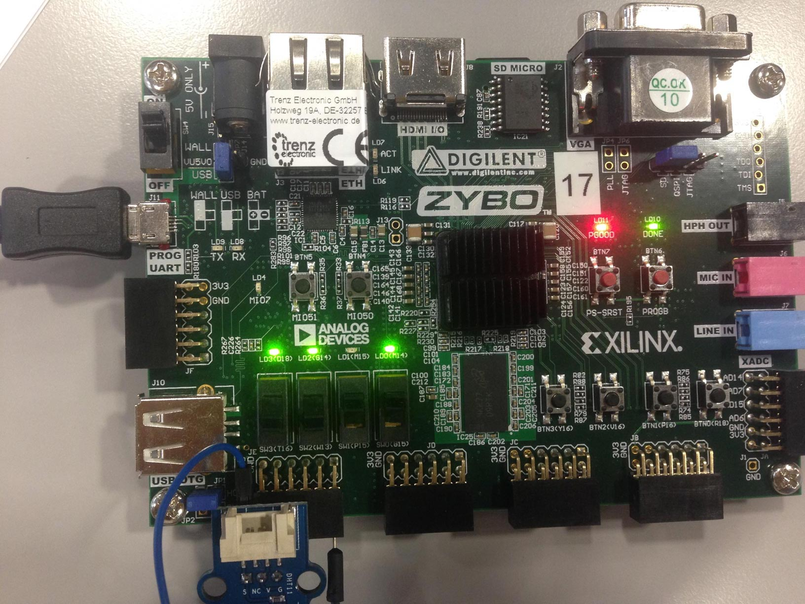

# DHT11 controller project

## Authors

* Caroline Astolfi (caroline.astolfi@eurecom.fr)
* Alexis Challande (alexis.challande@eurecom.fr)
* Matthias Pascal Clad (clad@eurecom.fr)

## Block diagram


The controller is driven either by the Stand Alone component or the DHT AXI component.

## Technical details
### Common details
DHT send data over 40 bits which are used as stated in the schema below.
We choose bits on those 40 to display according to the 3 first switches of the system (SW0 - SW2).
```
    SW0,SW1,SW2
     1   1   1      1  1  0      1  0  1      1  0  0  |  0   1   1     0  1  0      0  0  1      0  0  0  |  not displayed
   +------------+------------+------------+------------+------------+------------+------------+------------+-----------------+
   |    1010    |    0110    |    0001    |    0100    |    0010    |    1110    |    0011    |    1100    |     01011001    |
   +------------+------------+------------+------------+------------+------------+------------+------------+-----------------+
                      Humidity data                    |                   Temperature                     |     CHECK SUM

```

## DHT Controller (standalone)

### DHT Controller
#### Entity name: dht11_ctrl

Type | Name | Explanation
------------ | ------------- | ---------
Input | `clk` | Clock of the system
Input | `srstn` | Active low synchronous reset
Input | `start` | Debounced push button / Start the acquisition
Input | `data_in` | Data coming from the DHT11
Output | `data_drv` | Data sent to the DHT11
Output | `pe` | Protocol error bit - Raised if there is a problem during the acquisition
Output | `b` | Busy bit - Set to 1 if the system is busy
Output | `do` | The 40 bits of data sent by the DHT11

#### Finite state machine


The controller is a Melay state machine, where it states are : `IDLE`, `INIT`, `STORE`, `SET_DO`, `COUNTER_RESET`, `STARTING1`, `STARTING2`, `SENDING0`, `SENDING1`, `RECEIVING0`, `RECEIVING1`, `ENDTRANSACTION`. The design is synchronized on the rising edge of the clk and reset by the active low synchronous reset `srstn`.

State | Description | Normal transition | Error transition
--- | --- | --- | ---
INIT | Initialization state: when DHT11 starts | IDLE | -
IDLE | Idle state: reset all the local variables | STARTING1\* | -
STORE | Drive the reading process for each bit of DHT11 | ENDTRANSACTION\* | -
SET_DO | Copy the read bits to the output of the system | IDLE | -
STARTING1 | Send GND for at least 18000 us| STARTING2\* | -
STARTING2 | Send VCC for at least 20-40 us | SENDING0\* | IDLE
SENDING0 | Receive GND for 80 us | SENDING1\* | IDLE
SENDING1 | Receive VCC for 80 us | RECEIVING0\* | IDLE
RECEIVING0 | Count the time when we receive 0 | RECEIVING1\* | IDLE
RECEIVING1 | Count the time when we receive 1 | STORE | IDLE
ENDTRANSACTION | Check if we receive the end of the transaction | SET_DO | IDLE
_COUNTER\_RESET_ | _Reset the counter and go to the next state_ | _-_ | _-_

The \* next to the name of a state, indicates that it will go through the `COUNTER_RESET`.


### Shift Register
#### Entity name: sr

Type | Name | Explanation
--- | --- | ---
Input | `clk` |  Clock of the system
Input | `sresetn` | Active low synchronous reset
Input | `shift` | Shifter signal send by the controller (when a bit is read)
Input | `di` | Read bit sent by the controller
Output | `do` | Accumulated bits
Output | `resetSr` | Reset the shift register

Every time we read one bit from the DHT11, we accumulate it in our register using the shift register.

### Timer
#### Entity name: timer
Type | Name | Explanation
--- | --- | ---
Input | `clk` |  Clock of the system
Input | `sresetn` | Active low synchronous reset
Output | `pulse` | Every period, the pulse is set to 1 so the counter can increment

We use this to count time spent in a state or waiting for something.
Every time a micro second is elapsed, the pulse is asserted high and the inner counter can be incremented.

## DHT StandAlone
### Entity name: dht11_sa
Type | Name | Explanation
------------ | ------------- | ---------
Input | `clk` | Clock of the system
Input | `rst` |  Active high synchronous reset
Input | `btn` | Press button on the ZYBO board
Input | `sw` | Slide switches on the ZYBO board
Input | `data_in` | Data coming from the DHT11
Output | `data_drv` | Data sent to the DHT11
Output | `led` | LED on the Zybo board

This entity is managing the controller and outputs the result on the Zybo LEDs.
In addition it computes the checksum of the received data.

It uses a debouncer for the start button:
### Entity name: debouncer
Type | Name | Explanation
------------ | ------------- | ---------
Input |`clk` |  Clock of the system
Input |`sresetn`| Active low synchronous reset
Input |`d` | Input bouncing signal
Output | `q` | *NOT USED* Synchronized and debounced signal
Output | `r` | Rising edge detector
Output | `f` |*NOT USED*  Falling edge detector
Output | `a`| *NOT USED* Any edge detector

## AXI version
### Slave

The slave is responsible to deal with the DHT11 controller mentioned earlier in this document.

### Entity name: dht11_axi
Type | Name | Description
 :----      | :----                           | :----
Input | `aclk`|  Master clock
Input | `aresetn`    | *Synchronous*, active low reset
Input |  `s0_axi_araddr`    |    Read address
Input |  `s0_axi_arprot`    | Protection type - the privilege level of the transaction and whether it is a data or instruction access
Input |  `s0_axi_arvalid`   | Read address valid - indicates that the channel is signaling valid read address and control information
Input |  `s0_axi_rready`    | Read ready - indicates that valid read data are available
Input |  `s0_axi_awaddr`    | Write address
Input |  `s0_axi_awprot`    |Protection type
Input |  `s0_axi_awvalid`   | Write address valid - indicates that the channel is signaling valid write address and control information
Input |  `s0_axi_wdata`    | Write data
Input |  `s0_axi_wstrb`    |  Write strobe
Input |  `s0_axi_wvalid`    | Write valid - indicates that valid write data and strobes are available
Input |  `s0_axi_bready`    | Write response ready
Input |  `data_in`    |  The input data
Output |  `s0_axi_arready`   |  Read address ready
Output |  `s0_axi_rdata`    |  Read data
Output |  `s0_axi_rresp`    |  Read response
Output |  `s0_axi_rvalid`    | Read valid - indicates that valid read data are available
Output |  `s0_axi_awready`   | Write address ready - indicates that the slave is ready to accept an address and the associated control signals
Output |  `s0_axi_wready`    | Write ready - indicates that the slave can accept the write data
Output |  `s0_axi_bresp`    | Write response
Output |  `s0_axi_bvalid`   | Write response valid - indicates that the channel is signaling a valid write response
Output |  `s0_axi_data_drv` | The signal to drive the DHT11

#### State machine

The first state machine is responsible to deal with the start of the DHT11

State | Description | Normal transition | Error transition
--- | --- | --- | ---
INIT | Initialization state: reset everything to 0 | IDLE | -
IDLE | Do nothing | WAITING1 | -
WAITING1 | Set the status and the data | SEND_START | -
SEND_START | Send the start signal | WAITING2 | -
WAITING2 | Assert data and status | SEND_START | -

After the reset has been de-asserted, the wrapper waits for 1 second and sends the first start command to the controller. Then, it waits for one more second, samples the sensed values in DATA, and the status in STATUS, and sends a new start command to the controller. This is repeated every second, until the reset is asserted.


#### Axi State Machine
##### Write state machine


##### Read state machine

We have two of those, one for reading, one for writing but they are working similarly.


State | Description | Normal transition
--- | --- | ---
IDLE | Initialization state: reset everything to 0 | ACK
ACK | Reception of the address for the operation | ANSWER
ANSWER | Respond to the operation | IDLE


### Master
#### Entity name: dht11_axi_top.vhd
The master has been written by Renaud Pacalet, ask him any questions about it.

## Functional validation

### Standalone
The functional validation took us a lot of time and made us change our architecture way more than expected.
We're using the simulation environment provided by the teacher (Renaud Pacalet).

### AXI Version
The functionnal validation has been done using the simulation environment given by the teacher (Renaud Pacalet).
It is working without any problem, however we are skeptical about the start signal every second since we may not have the time to read the data sent by the DHT11.

## Synthesis
### Standalone version
We used the synthesis files provided by the teacher (Renaud Pacalet). They worked perfectly fine.
We checked all the reports generated by the tool and we did not see any errors or troublesome warnings.
We generated the boot image and copied it on the Zybo.
See the [next section](#standaloneexperiment) for more details

### AXI Version
In the beginning we had some issues regarding the synthesis for the AXI version due to some mistakes. But in the end everything worked as expected. So we generated the boot image and copied it on the Zybo to test it.

## Experiments on the Zybo
### <a name="standaloneexperiment"></a> Standalone version
- We have a lot of checksums and/or protocols errors while using the DHT11 but sometimes it works.
- We managed to get the temperature : 24°C
- And the humidity : 45%

See the photos below for some results
- High bits for temperature

- Low bits for temperature

- High bits for humidity

- Low bits for humidity

- No errors !!


### AXI Version
*Sadly no pictures*
We finally managed to do some experiments on the zybo, however the results are not really good.


> T: 96°C H: 240% <br>
> H: 232% T: 100°C


And we have some errors in the status: <br/>
`Sab4z> devmem 0x40000004 32` <br/>
`$ 0x00000005`
