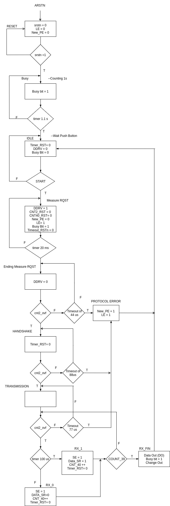

<!-- vim: set textwidth=0: -->

[DHT11.pdf]: DHT11.pdf
[README.md]: README.md
[src_standalone_version]: src_standalone_version/
[sa_synthesis_out_files]: src_standalone_version/sa_synthesis_out_files/
[src_AXI_version]: src_AXI_version/
[axi_synthesis_out_files]: src_AXI_version/axi_synthesis_out_files/
[sim_files]: sim_files/
[picture]: picture/
[Caracci_Dey_Liao]: https://gitlab.eurecom.fr/renaud.pacalet/ds-2017/tree/master/dht11/Caracci_Dey_Liao

# DHT11 controller project
## Authors
* Fabio CARACCI (fabio.caracci@eurecom.fr)
* Prashant Kumar DEY (dey@eurecom.fr)
* Chin-Te LIAO (Chin-Te.liao@eurecom.fr)

## Supervisor
* Professor Renaud PACALET

## Index
* [Introduction] (#introduction)
	* [Git organisation](#git)
* [DHT11 specifications] (#specification)

1. [Standalone version](#Standalone)
	* [Block diagram] (#blockdiagram)
	* [Technical details] (#techdetails)
		* [Datapath] (#datapath)
		* [Control Unit] (#controlunit)
	* [Component details] (#codingdetails)
	* [Functional validation] (#functionalvalidation)
	* [Synthesis] (#sythesis)
	* [Test on the Zybo] (#experiment)
1. [AMBA-AXI BUS version] (#axi)
	* [Introduction] (#axiintro)
	* [Block diagram] (#axi_blockdiagram)
	* [AXI specifications] (#axi_specifications)
	* [Datapath for AXI4-lite](#DP_AXI)
	* [FSM with AXI4-lite protocol] (#axifsm)
		* [Master to Slave] (#aximts)
		* [Slave to Master] (#axistm)
	* [Results from terminal] (#axiresult)

* [Acknowledgement](#Acknowledgement)

## Introduction <a name="introduction"></a>
The topic of this project is the digital hardware design of a controller for a sensor of humidity and temperature, the DHT11 (Datasheet: [DHT11.pdf]).  
In a first step a standalone version for the controller has been realized and completely synthesized on the FPGA; later this design was modified in order to use the AMBA AXI4-lite protocol to communicate with the embedded cortex-A9.  
The project to be completed followed these steps:
* Theoretical Study and Review: We studied the sensor's datasheet, other documentations, and specifications.
* Designing Architecture: We designed Data Path and FSM and reviewed it with various constraints. 
* Development in VHDL: we described the designed architecture in VHDL.
* Simulation: we designed the simulation environment for each of our components and ran the Modelsim simulation tool looking at the waveforms.
* Synthesis: Once we were satisfied with the simulation part we went to test our design on Zybo board. We then checked for its performance and optimized it.

## Git organisation <a name="git"></a>
This repository is organised as follow:  
../[Caracci_Dey_Liao]/  
├── [README.md]                      - this file  
├── [DHT11.pdf]                      - DHT11 datasheet  
├── [src_standalone_version]/					- contain the source files of the standalone version  
│   └── [sa_synthesis_out_files]/			- it contain some output of the synthesis, like the binary  
├── [src_AXI_version]/							- contain the source files of the AXI version  
│   └── [axi_synthesis_out_files]/		- it contain some output of the synthesis, like the binary  
├── [sim_files]/					- contain the source files for the synthesis  
└── [picture]/                       - DHT11 datasheet & results of simulations for each components  

## DHT11 specifications <a name="specification"></a>
1. Global
	- 4 ms Communication
	- 40 bits complete data (Most Significant Bits first)
1. To start:
	* MCU drive:
		1. GND (meaning 0) at least 18 ms  
		2. VCC (meaning 1) between (20-40) μs
	* DHT drive:
		1. GND for 80 μs  
		2. VCC for 80 μs  

1. To send data:
	For every bit of data:
	1. GND for 50 μs
	2. VCC for 26-28 μs to send 0 OR VCC for 70 μs to send 1

### Data to be shown

SW0 decides whether we want Humidity data or Temperature data.<br>
```
    SW0,SW1,SW2  
     1   1   1      1  1  0      1  0  1      1  0  0  |  0   1   1     0  1  0      0  0  1      0  0  0  |  not displayed
   +------------+------------+------------+------------+------------+------------+------------+------------+-----------------+
   |    1010    |    0110    |    0001    |    0100    |    0010    |    1110    |    0011    |    1100    |     01011001    |  -> 40 bits from the DHT11 sensor 
   +------------+------------+------------+------------+------------+------------+------------+------------+-----------------+
                      Humidity data                    |                   Temperature                     |     CHECK SUM
```

-------
# Standalone version <a name="Standalone"></a>
## Block diagram <a name="blockdiagram"></a>

```
            _ _ _ _ _ 
           |         | 4 bits
    SW0 -->|         |--/--->  4 LEDS
    SW1 -->|         |
    SW2 -->|   MCU   |<----- data_in
    SW3 -->|         |
    BTN -->|         |-----> data_drv
           |_ _ _ _ _|
             ^    ^
             |    |
            RST   CLK
    
```
<br><div style="text-align:center"> Diagram 2: Micro-Controller Unit </div><br>

## Technical details <a name="techdetails"></a>
The whole DHT11 project is divided into 2 main parts: Datapath (DP) and Control Unit (CU). Datapath handles the received data and provides useful status signals (e.g. counters and timeout) to the CU; it has been divided into different small blocks depending on the realized function because of simplicity.
While for the Control Unit we chose a Moore machine model and it provides the controlling signals to the DP.
First of all, an initial DP was designed, then we derived the FSM for the CU and after revised the final DP.

### Datapath <a name="datapath"></a>
Data Path has been divided into several blocks: Synchroniser, Shift Register, Selector, Checksum, Error Block, Multiplexer, ...  


<br><div style="text-align:center"> Diagram 1: Datapath </div><br>

<br>**Synchroniser** is an element that interface both the DHT11 controller and the sensor dataline; it provides one CLK pulse when dataline change state. It is used to reset the `timeout` element and inform `cnt2` that an edge was detected.  

<br>**Cnt2** is used to understand when a bit has been transmitted.  

<br>**Cnt40** is used to understand when the whole 40 bits have been transmitted. It counts until 39.  

<br>**Shift Register** will take as input from the CU: one bit of data, Shift Enable (`SE`), change_output and resetn. Since it is synchronous the clock is provided. The 40 bits output is provided after a reset or when change_output is asserted.  

<br>**Selector** will take the 32 bit MSBs output from the Shift Register since these are the data bits. It also has three switches which will help in selecting the 4 output bits, since only 4 LEDs to display the output can be used. Switch0 (`SW0`) will be responsible for choosing between the Humidity or Temperature. In the data bits, we have `8 bit of integral RH + 8 bit of decimal RH + 8 bit of integral Temperature + 8 bit of decimal Temperature`. However, it can be noticed that the decimal parts are always '0' because of the low sensor's sensibility.  

<br>**Checksum** takes as input 32 bits data and 8 bit of checksum, so it takes all the 40 bit input from the shift register. The 32 data bits are divided into 4 8-bit chunks and then they are added. The last 8 bit of this addition result is compared with the 8-bit checksum data.  

<br>**Error Block** will just take the data which are Protocol Error, Switch0, Busy Bit and Checksum_error and will forward them to the MUX in a vector type. It is just a block used to group those signals.  

<br>**Mux2x1** is used to select the output, between data and errors, to be forwarded to LEDs.  

<br>**Timeout** will check the time lapsed between the last TX bit and the actual time. If it too much time lapsed its output will inform the FSM.  

<br>**Timer** it looks like the timeout but it is used to control the duration of a phase e.g. the 20 ms to start a measurement request or to detect if the TX bit is 1 or 0 the FSM will check its signal to understand if 100us passed (it is the middle point between the difference of duration for TX 1 or 0).  

<br>**PE_enable** is a register used to maintain the previous value of PE and refresh its signal when LE is asserted.

### Control Unit <a name="controlunit"></a>
* **Finite State Machine**

As mentioned, a Moore state machine was chosen and can be seen on the FSM picture.<br>

<div style="text-align:center"> Diagram 2: FSM Flowchart </div>

The first state is the one reached after the power-up-reset or after pressing the RST button and here everything is reset. Soon a `BUSY` state is reached since, after the power-up, one second waiting should be guaranteed to let the sensor working correctly. In it, the Busybit is asserted.  

<br> When 1.1 second delay elapsed a corresponding signal is asserted from the *Timer* in the DP and the machine state move to `IDLE`. The Busybit is now '0' and the *timer_reset* is provided (even if rst is not needed because provided by **Sync&Pulse**).  

<br> If button1 is pressed (a debouncer is used) a `measure_RQST` is obtained and the preparation for it begin: again DP counters are reset and so also CNT2 value is 0. The sensor Data Line is forced to 0 asserting ddrv signal. A change in DataLine is detected (after 2 CLK) from **Sync&Pulse**, but CNT2 remains to 0 because of the asserted CNT2_rst and Timer is now reset since, 20ms should elapse to change the current state.  

<br> In the following `ending_meas_RQST` state ddrv is '0' (DataLine released to 1) and thus after 2 CLK delay CNT2 is incremented to 1 and if no Timeout (faults) occurs in waiting for DHT response, after 40us max, the falling edge of DataLine will enable a pulse from **Sync&Pulse** and so CNT2 will have an overflow, that is used from CU to understand that a TX from the Sensor began.  

<br> In the `handshake` state the sensor preamble is checked and if there are no faults, the `transmission` state will be reached where controls are done to verify the transmitted value.

<br> `RX_1` and `RX_0` are different only in terms of the data sent to SE. After that the CNT40 output is controlled, if it is 39, which means that the current received bit is the 40th and so `RX_FIN` is the next state. Now the SE output is updated and the `Busy` state will be the next state.

<br> This last choice will assert the Busy bit for 1.1s after the measurement ended because this amount of time should be respected before asking the sensor another measure (as suggested in the datasheet).  

<br> `Protocol error` state only assert the the error bit and next state will be again `Busy`.

## Component details <a name="codingdetails"></a>
Our whole code has been divided into small blocks which can be seen from in the Datapath picture above. All those blocks are briefly presented here with a bit of details.<br>
The finite state machine (`fsm.vhd`) represents the logic of this DHT11 design and is used to move through different states according to given parameters.  
It can be noticed that the FSM output are assigned in such a way that they have a default value and they change only if needed in a particular status when it is changed. So the outputs are latched by the status change and *fsm.vhd* is more compact and readable.  


* **PE_enable**
	The `PE_enable` is used to refresh PE signal when LE is asserted.

	```vhdl
	Input:
	1. clk -----------------std_ulogic -- clock
	2. LE  -----------------std_ulogic -- load enable
	3. New_PE     ----------std_ulogic -- new protocol coming in

	output:
	1. PE:        ----------std_ulogic -- the updated protocol error
	```
	
	<div style="text-align:center"> Diagram: PE_enable Simulation </div>

* **Synchroniser**
	The Synchroniser is used to receive signals from the external world because it is asynchronous with respect to our controller and so meta-stability must be avoided.

	```vhdl
	input:
	1.clk   -----------------std_ulogic -- clock
	2.input -----------------std_ulogic -- input from the sensor DHT11
	output:
	1.output-----------------std_ulogic -- output to pulse converter & Shift Register.
	```

* **Shift Register**
	The shiftReg.vhd will insert the new data input into data output and checksum by dropping *std_ulogic_vector bit 39* (discarding the MSB) and inserting a *std_ulogic* at *std_ulogic_vector bit 0*

	```vhdl
	input:
	1.clk    -------------------std_ulogic -- clock
	2.sresetn-------------------std_ulogic -- reset active low
	3.data_in-------------------std_ulogic -- data input
	4.SE     -------------------std_ulogic -- shift enable bit(1:on, 0:off)
	output:
	1.data_out------------------std_ulogic_vector(39 downto 8) -- data output
	2.checksum_out--------------std_ulogic_vector(7 downto 0)  -- checksum
	```
	 
	<div style="text-align:center"> Diagram: Shift Register Simulation </div>

* **Selector**
	The selector.vhd receive data input from our Shift Register, then gives data output according to the selecting switches as input.

	```vhdl
	input:
	1.data_in    -------------------std_ulogic_vector(31 downto 0) -- data from ShiftReg
	2.sw         -------------------std_ulogic_vector -- switch
	output:
	1.data_out    ------------------std_ulogic_vector(3 downto 0)  -- data output

	```

* **Checksum**
	The checksum.vhd is used to compute the checksum error. `8bit integral RH data + 8bit decimal RH data + 8bit integral T data + 8bit decimal T data` and then taking the last 8 bit as the checksum output.

	```vhdl
	input:
	1.data_in    -------------------std_ulogic_vector(31 downto 0) -- data to check
	2.cksum      -------------------std_ulogic_vector(7 downto 0)  -- cksum
	output:
	1.ce_error    ------------------std_ulogic                     -- assert when checksum error happened
	```
	 
	<div style="text-align:center"> Diagram: Checksum Simulation </div>

* **Error Block**
	Error block is designed to take the input of PE, switch 0, busybit and checksum and then output them grouped to the MUX.

* **2  Overflow Counter**
	The CNT_2.vhd is used to rise output signal to 1 for one CLK period when the temporary cnt value become again 0 (when the overflow arrives).
	```
	input:
	1.clk--------------------std_ulogic -- clock
	2.resetn-----------------std_ulogic -- reset active low
	3.count------------------std_ulogic -- data input
	output:
	1.Ovf    ----------------std_ulogic -- data output
	```
	
	<div style="text-align:center"> Diagram: 2  Overflow Counter Simulation </div>

* **40 Overflow Counter**
	The CNT_40.vhd is used to rise output signal to 1 when input accumulates to 39. It is 39 and not 40 because the last check in the FSM will be done on the CNT_40 before it can be updated, so when the 39 is read after the RX_ state it means that already 40 bits were received.

	```
	input:
	1.clk--------------------std_ulogic -- clock
	2.resetn-----------------std_ulogic -- reset active low
	3.count------------------std_ulogic -- data input
	output:
	1.cnt_end----------------std_ulogic -- data output
	```
	
	<div style="text-align:center"> Diagram: 40 Overflow Counter Simulation </div>

* **Timer Module**
	This block will take care for the time and has different cases at which it will provide the actual time information to the CU.  
	The pulse output shall thus be periodic and its period shall be timeout micro-seconds. The figure below represents the clk, sresetn, tick and pulse signals for freq=3 and timeout=2.
	
	Below there is the table with the asserted signals.
	
	| out bits |         Time         |
	| -------- |:--------------------:| 
	| 00       |      until 50 us     | 
	| 01       | from 50us until 20ms | 
	| 10       | from 20ms until 1.1s | 
	| 11       |      after 1.1s      |

	 
	<div style="text-align:center"> Diagram: Timer Simulation </div>

* **Timeout Module**
	This block will take care of counting the time elapsed and also has different cases at which it will provide the delay information to the CU.

	| out Bits |        Time         |
	| -------- |:-------------------:| 
	| 00       |     until 44 us     | 
	| 01       | from 44 until 77 us | 
	| 10       | from 77 until 88 us | 
	| 11       |     after 88 us     |

	
	<div style="text-align:center"> Diagram: Timeout Simulation </div>

* **Mux**
	This is the output block which will select the input between the `error_data` and `data` from the selector. The 4 LEDs are connected to its output.

## Functional validation <a name="functionalvalidation"></a>
For each block of the DP a simulation file was created and thus the element was checked before inserting it in the DP circuit. In fact, it was much easier debugging the smallest block while designing them such that few or none unexpected behaviors could happen. <br> 
Those files are in the [sim_files/](sim_files/) folder. Some simulation screenshots were taken and the picture are in the [picture/](picture/) folder and are shown below.  <br>
The functional validation of the whole controller was applied using the first simulation file provided and adapting few parameter and modifications.  <br>
Since our design is really simple and do not pay attention to strict constraints (but e.g. it cares about the total time of a bit TX) many warnings were ignored and some other investigated possibly revising the design.  <br>
However few errors were present and to better investigate some possible bugs few basic and adapted simulations were built. <br> 
Because of the lacking time the last test was done directly on the board after Synthesis. In fact, many configurations were checked and a complete set of test was done directly on the board (for instance detaching the DataLine cable and verify the errors).  

## Synthesis <a name="synthesis"></a>
The synthesis process revealed bugs in `timeout`, `timer`. They were about not completely and exhaustive specified behaviors.  
From synthesis, we saw how many and wich FPGA internal cells were used, and lots of other information.

## Experiment on the Zybo <a name="experiment"></a>
The first experiment on the Zybo revealed that the controller performed the operations as expected and so it worked well at the first try.  
To test the correct behavior of the sensor many measurements results were analyzed for instance both temperature and humidity had reasonable values in normal conditions (T= 26, H= 45) and after heating the sensor by breathing on it (T= 31, H= 80).  <br>
Furthermore, a video was recorded and is uploaded on YouTube and linked here: [DHT11 Project | Eurecom](https://www.youtube.com/watch?v=1M6Qyv4ydCY).  
Some pictures are also attached below.<br>
**Value for temperature: 00011011 = 27C°**


<br>
**Value for humidity: 00111111 = 63%**


------
# AMBA-AXI BUS version <a name="axi"></a>
## Introduction <a name="axiintro"></a>
The ARM **Advanced Microcontroller Bus Architecture (AMBA)** is an open-standard, on-chip interconnect specification for the connection and management of functional blocks in system-on-a-chip (SoC) designs. It facilitates the development of multi-processor designs with large numbers of controllers and peripherals. Since its inception, the scope of AMBA has, despite its name, gone far beyond microcontroller devices. Today, AMBA is widely used on a range of ASIC and SoC parts including applications processors used in modern portable mobile devices like smartphones. AMBA is a registered trademark of ARM Ltd. [Wikipedia](https://en.wikipedia.org/wiki/Advanced_Microcontroller_Bus_Architecture) <br>

**Advanced eXtensible Interface (AXI)**  
AXI, the third generation of AMBA interface defined in the AMBA 3 specification, is targeted at high performance, high clock frequency system designs and includes features that make it suitable for high speed sub-micrometer interconnect:
* separate address/control and data phases
* support for unaligned data transfers using byte strobes
* burst based transactions with only start address issued
* issuing of multiple outstanding addresses with out of order responses
* easy addition of register stages to provide timing closure.
<br>
By using AXI4-lite protocol, we can easily read sensor values and access the board by terminal because the FPGA will interact with the micro-controller and it will forward the data via USB.

## Block diagram <a name="axi_blockdiagram"></a>

```
            _ _ _ _ _ _ _                  _ _ _ _ _ _ _             _ _ _ _ _ _ _
           |             |                |             |           |             |
    SW0 -->|             |   read-line    |             |           |             |
    SW1 -->|             |<-------------->|             |           |             |
    SW2 -->|             |                |     ARM     |    USB    |             |
    SW3 -->|    FPGA     |    AXI BUS     |  Cortex-A9  |<--------->|     PC      |
    BTN -->|  Controller |                |             |           |             |
           |             |<-------------->|             |           |             |
    RST -->|             |   write-line   |             |           |             |
    CLK -->|_ _ _ _ _ _ _|                |_ _ _ _ _ _ _|           |_ _ _ _ _ _ _|
```
<br><div style="text-align:center"> Diagram 2: Micro-Controller Unit </div><br>

## AXI specifications <a name="axi_specifications"></a>
AXI4 lite wrapper around the DHT11 controller dht11_ctrl(rtl). It contains two 32-bits read-only registers:

```
Address                Name    Description
0x00000000-0x00000003  DATA    read-only, 32-bits, data register
0x00000004-0x00000007  STATUS  read-only, 32-bits, status register
0x00000008-...         -       unmapped
```
Writing to DATA or STATUS shall be answered with a SLVERR response. Reading or writing to the unmapped address space [0x00000008,...] shall be answered with a DECERR response.  
The reset value of DATA is 0xffffffff.  
	* DATA(31 downto 16) = last sensed humidity level, Most Significant Bit: DATA(31).  
	* DATA(15 downto 0) = last sensed temperature, MSB: DATA(15).  
The reset value of STATUS is 0x00000000.
	* STATUS = (2 => PE, 1 => B, 0 => CE, others => '0'), where PE, B and CE are the protocol error, busy and checksum error flags, respectively.  
After the reset has been de-asserted, the wrapper waits for 1 second and sends the first start command to the controller. Then, it waits for one more second, samples DO(39 downto 8) (the sensed values) in DATA, samples the PE and CE flags in STATUS, and sends a new start command to the controller. And so on every second, until the reset is asserted. When the reset is de-asserted, every rising edge of the clock, the B output of the DHT11 controller is sampled in the B flag of STATUS.

## Datapath for AXI4-lite <a name="DP_AXI"></a>
The DP only changes a little and we kept the same Controller. Plus, many component used in the Standalone version are no more used (selector, errBlock, mus2x1).<br>
Instead, new components are:
* `regNbit1rst`:  
	it is used as DATA register (32-bit). After reset his content is set to 0xffffffff. Its content is updated every CLK (it is a bad behavior, but otherwise the `dht11_ctrl` should have been changed) with the daca coming from the shift register.
* `regNbit0rst`:  
	it is used three times thanks to a **Generic** value:
	* to store the status values in a 32-bit register
	* to store in a 30-bit Register the write address
	* to store in a 30-bit Register the read address
* `mux2to1_Nbit`:  
	select which output to forward (between status, if *statusN_data* = 0, or data, if *statusN_data* = 1) after a read request.
* `timerN`:
	it is used to generate the start signal for `dht11_ctrl` every second (this delay can be easily incremented changing the value in `constants_pkg.vhd`).


## FSM with AXI4-lite protocol <a name="axifsm"></a>
To implement the AXI protocol we designed two FSM (master to slave: that is u-controller to FPGA & slave to master: FPGA to u-controller) and implemented the states change as shown in the graphs below.

### Master to Slave <a name="aximts"></a>
Knowing the requirements written in the section AXI specifications to handle write requests from the Master, we made this design.
Since our controller cannot manage any writing, an error response is always forwarded (DECERR or SLVERR depending on the address) if asked to write.
The resulting FSM is simple:
The slave waits that both `WVALID` (write valid) and `AWVALID` (write address valid) are valid and thus a valid write operation is requested.
Then the Slave answer that is ready to handle this request asserting `WREADY` (write ready) and `AWREADY`(write address ready).
Now a check on the address is performed and the corresponding error `BRESP` (write response) reported to the Master asserting `BVALID` (write response valid) and waiting for the Master acknowledgement with `BREADY` (response ready).


### Slave to Master <a name="axistm"></a>
This FSM realise the requirement written in the section [AXI specifications](#axi_specifications) to handle read requests from the Master.  
Also, in this case, the resulting FSM is quite simple:  
The slave waits for `ARVALID`(read address valid) and thus a valid read operation is going to be requested.  
So the Slave answer that is ready to handle this request asserting `ARREADY` (read address ready).  
Now a check on the address is performed and if it is lower than 0x00000004, means that the u-controller is asking to read the data. Thus, `Sel`, that selects the output of *mux2to1Nbit*, is set to 1 (to output the data) and `RRESP` (read response) is set to '00' (OKAY) then reported to the Master asserting `RVALID` (read valid) and waiting for the Master acknowledgement with `RREADY` (Read ready).
If the Read_Address goes between 0x00000004 and 0x00000007, the same operation as mentioned before are performed, also the output should be the Status register when `Sel` is set to 0. Otherwise, it means that the Address was out of range and DECERR is reported to the Master setting `RRESP` to '11' and performing as before.


## Results from terminal <a name="axiresult"></a>
To show the results in the terminal we used a provided tool.

```
Welcome to SAB4Z (c) Telecom ParisTech
sab4z login: root
Sab4z> devmem 0x40000000 32
0x27001900  #H:39 T:25
Sab4z> devmem 0x40000004 32
0x00000000
Sab4z> devmem 0x40000008 32
Unhandled fault: external abort on non-linefetch (0x018) at 0xb6f9c008
pgd = dd934000
[b6f9c008] *pgd=1e5dc831, *pte=40000783, *ppte=40000e33
Bus error
Sab4z> devmem 0x40000000 32 0
Unhandled fault: external abort on non-linefetch (0x1818) at 0xb6f11000
pgd = dda60000
[b6f11000] *pgd=1e67e831, *pte=40000743, *ppte=40000c33
Bus error
Sab4z> devmem 0x40000004 32 0
Unhandled fault: external abort on non-linefetch (0x1818) at 0xb6fc9004
pgd = dd934000
[b6fc9004] *pgd=1e4c1831, *pte=40000743, *ppte=40000c33
Bus error
Sab4z> devmem 0x40000008 32 0
Unhandled fault: external abort on non-linefetch (0x818) at 0xb6fad008
pgd = dda60000
[b6fad008] *pgd=1e4d6831, *pte=40000743, *ppte=40000c33
Bus error
Sab4z> 

-- after breathing on the sensor
Sab4z> devmem 0x40000000 32
0x27001800 #H:39 T:24
Sab4z> devmem 0x40000000 32
0x4C002200 #H:76 T:34
Sab4z> devmem 0x40000000 32
0x4E002100 #H:78 T:33
Sab4z> devmem 0x40000000 32
0x59001C00 #H:89 T:28
Sab4z> devmem 0x40000000 32
0x40001800 #H:64 T:24
```
We can tell that everything work well, in fact an error was generated when we try to read from an unmapped address, the correct status signal was returned then finally the humidity and temperature values were correct, so we can compare the normal values and those after breathing upon the sensor.


------
# Acknowledgement <a name="Acknowledgement"></a>
We would like to express our sincere gratitude to Professor Renaud Pacalet for allowing us to undertake this work and carefully providing lots of help while developing it.  
Thanks to EURECOM University for the provided material.  
We really enjoyed working on this project, moreover, we were satisfied when we saw our design working well and performing the correct operations!
Thanks.
