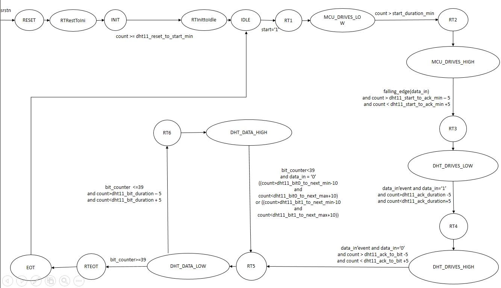
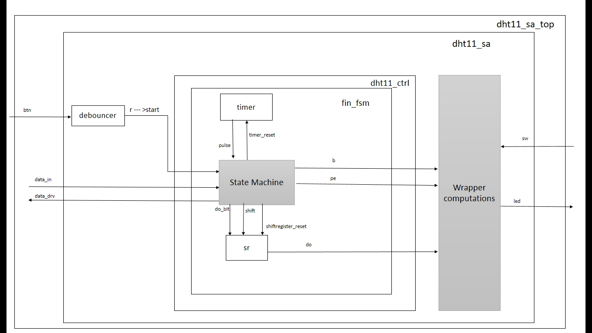
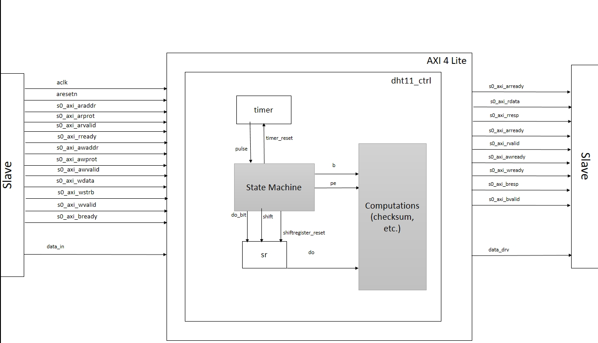
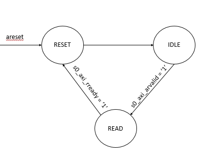
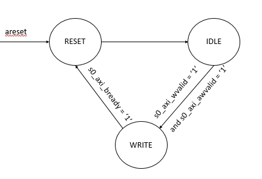

<!-- vim: set textwidth=0: -->

# DHT11 project

## Authors

* Florian KOHLER (florian.kohler@eurecom.fr)
* Thibault PETITJEAN (thibault.petitjean@eurecom.fr)

## Objectives

The goal of that project was to read the humidity level and the temperature of a room using a [DHT11 sensor](https://gitlab.eurecom.fr/renaud.pacalet/ds-2017/blob/master/doc/DHT11.pdf) and a [Zybo board](https://gitlab.eurecom.fr/renaud.pacalet/ds-2017/blob/master/doc/zybo_rm.pdf) FPGA.
In class, we had firstly come to some agreements about the expected and required behaviour of our design. They can be found [here](https://gitlab.eurecom.fr/renaud.pacalet/ds-2017/blob/master/doc/dht11.md).

Two solutions were then developed: one where the buttons and switches of the Zybo board were used to display the data onto LEDs (called the *standalone* version), and an AXI version whose objective was to automatically read the data using the AXI protocol embeded in the software running Zybo (called the *AXI* version).

First will be described the core of the system: the controller, and then the *standalone* version, and finally the *AXI* version.
 
## The Controller

The **controller** aims at getting the 40 bits sent by the dht11 sensor. It contains a Finite State Machine (FSM) *fin_msm*, which is a Mealy State Machine. It also contains a timer *timer* which allows the FSM to get some information about the time elapsed since the last requested reset, and a shift register *sr* which aims at putting together the 40 bits that have been read one by one.


### The Mealy Finite State Machine

Our Finite State Machine and the 16 different states that it contains are represented below, including their main transitions:

Note: For reasons of readability, some links do not appear. 
In particular, the states ``IDLE``, ``MCU_DRIVES_LOW``, ``MCU_DRIVES_HIGH``, ``DHT_DRIVES_LOW``, ``DHT_DRIVES_HIGH``, ``DHT_DATA_LOW``, ``DHT_DATA_HIGH`` and ``EOT``:

* Include some protocol error detection (timeout, no valid signal read, etc). When the various criterias of error are detected, all these states will raise a protocol error and go directly to the state `IDLE`.
* Have a transmission to themselves whenever no condition to go to another state is valid.


Short descriptions of all the states that are used :

* `RESET` : State used after a reset.
* `RTRestoInit`, `RTInittoIdle`, `RT1`, `RT2`, `RT3`, `RT4`, `RT5`, `RT6` and `RTEOT` : All these states have been used for technical reasons and act as transition states that need to be gone in before going respectively in the states ``INIT``, ``IDLE``, ``MCU_DRIVES_LOW``, ``MCU_DRIVES_HIGH``, ``DHT_DRIVES_LOW``, ``DHT_DRIVES_HIGH``, ``DHT_DATA_LOW``, ``DHT_DATA_HIGH`` and ``EOT`. They aim at reseting the time counters that are needed in all the states, before switching to the relevant state. 
We cold have used a single state, since all of them have the same main interest (reseting the time counter). But since these states also have to be aware to know which state is the next one, we chose to put as many of these states as needed (rather than adding a register whose value could be the next state). 
* `INIT` : Initialization states, in which the FSM will stay for 1 second, as requested by the specification.
* `IDLE` : When the FSM is ready (either because the initialization is over or because the last reading is done), it is in this state, waiting for a `start` signal.
* `MCU_DRIVES_LOW` : MCU pulls down voltage to GCC for around 20 ms to let DHT11 detect the signal.
* `MCU_DRVES_HIGH` : MCU pulls up voltage to VCC for at least 20ms.
* `DHT_DRIVES_HIGH` : MCU receives VCC for around 20 to 40 micro-seconds.
* `DHT_DRIVES_LOW` : MCU receives GND for around 80 micro-seconds.
* `DHT_DATA_LOW` : MCU receives VCC for 
	* Around 26 to 28 micro-seconds (if the transmitted bit is 0)
	* Around 70 micro-seconds (if the transmitted bit is 1)
* `DHT_DATA_HIGH` : MCU receives VCC for around 20 to 40 micro-seconds.
* `EOT` : Stand for End Of Transmission. MCU receives GND for around 50 micro-seconds.

The following table includes all the input and outputs of this FSM and explains their role.

| Name       | Type                            | Direction | Explanation|
| :----      | :----                           | :----     | :----		|
| `clk`      | `std_ulogic`                    | in        | Master clock. The design in synchronized on the rising edge of `clk`.   |
| `srstn`    | `std_ulogic`                    | in        | *Synchronous* active low reset.   |
| `start`    | `std_ulogic`                    | in        |  Debounced bit for the push button.  |
| `data_in`    | `std_ulogic`                    | in        | Communication data line between the MCU and the DHT (1 bit).   |
| `data_drv`   | `std_ulogic`                    | out        | Bit driving data_in.
| `pe`    | `std_ulogic`                    | out        | Protocol Error bit (is 1 if there is a problem in the protocol, otherwise 0).|
| `b`   | `std_ulogic`                    | out        | Busy bit (is 1 when the relay after power up is not passed of if the sensor is currently sending data).|
| `do`  | `std_ulogic_vector(39 downto 0)`                    | out        | Data out. |


### The timer

The timer produces a pulse signal which is a tick that is produced every micro-second.
Generic parameters:

| Name       | Type                            | Description                                                         |
| :----      | :----                           | :----                                                               |
| `freq`     | `positive range 1 to 1000`      | Master clock frequency in MHz (also clock periods per micro-second). |
| `timeout`  | `positive range 1 to 1000000`   | Number of micro-seconds between two output pulses.                   |

Input / Output ports:

| Name       | Type         | Direction | Description                                                              |
| :----      | :----        | :----     | :----                                                                    |
| `clk`      | `std_ulogic` | in        | Master clock. The design is synchronized on the rising edge of `clk`.     |
| `sresetn`  | `std_ulogic` | in        | *Synchronous*, active low reset.                                          |
| `pulse`    | `std_ulogic` | out       | Asserted high for one `clk` clock period every `timeout` micro-seconds.   |

In our case, it is used with timeout = 1. Two following output pulses are therefore separated by 1 micro-second.

### The shift register

The shift register aims at gathering the bits that are received by the FSM from the sensor and put them in a 40 bits vector.

Input / Output ports :

| Name       | Type                            | Direction | Description                                                             |
| :----      | :----                           | :----     | :----                                                                   |
| `clk`      | `std_ulogic`                    | in        | Master clock. The design is synchronized on the rising edge of `clk`.   |
| `sresetn`  | `std_ulogic`                    | in        | *Synchronous*, active low reset.                                        |
| `shift`    | `std_ulogic`                    | in        | Shift command input. The register shifts when `shift` is asserted high. |
| `shiftregister_reset`    | `std_ulogic`                    | in        | Shift reset command input. Synchronous, active high reset. |
| `do_bit`       | `std_ulogic`                    | in        | Serial input of the shift register.                                     |
| `do`       | `std_ulogic_vector(39 downto 0)` | out       | Current value of the shift register.


## The *standalone* version

Here is the block diagram of the standalone version:



NB1: For practical reasons, this representation does not include most of the inputs "clk" and "srstn".
NB2: The grey boxes, unline the others, do not actually correspond to conceived entities. What these boxes do is what the global box in which they are do ("fin_fsm" for "State Machine" and "dht11_sa" for "Wrapper computations").
Outside the controller, the standalone version has to manage the deboucing of the push button and the computation and selection of the right data to display (including both the temperature or humidity display and the error one).

The data coming from the controller is firstly kept in a register.

| Name       | Type                            | Direction | Description                                                             |
| :----      | :----                           | :----     | :----                                                                   |
| `clk`      | `std_ulogic`                    | in        | Master clock. The design is synchronized on the rising edge of `clk`.   |
| `sresetn`  | `std_ulogic`                    | in        | *Synchronous*, active low reset.                                        |
| `btn`    | `std_ulogic`                    | in        | Push button.  |
| `sw`       | `std_ulogic_vector(3 downto 0)`                    | in        | Serial input of the shift register.                                     |
| `data_in`       | `std_ulogic` | in       | Communication line coming from the dht.                                    |
| `data_drv`       | `std_ulogic`                    | in        | Control signal, controlling data_in.                                    |
| `led`       | `std_ulogic_vector(3 downto 0)`                    | in        | Output LEDs.                                     |


### Debouncer

A debouncer `debouncer` allows to remove the problems due to the push button. It converts a potentially unstable `btn` input to a stable `start` output, that can be used by the FSM.

| Name       | Type                            | Direction | Description                                                             |
| :----      | :----                           | :----     | :----                                                                   |
| `clk`      | `std_ulogic`                    | in        | Master clock. The design is synchronized on the rising edge of `clk`.   |
| `sresetn`  | `std_ulogic`                    | in        | *Synchronous*, active low reset.                                        |
| `d`    | `std_ulogic`                    | in        | Input boucing signal.|
| `q`       | `std_ulogic`                    | out        | Output synchronized and debounced signal.                                     |
| `r`       | `std_ulogic` | out       | Rising edge detector.|
| `f`  | `std_ulogic`                    | out        | Falling edge detector.                                        |
| `a`  | `std_ulogic`                    | out        | Any edge detector.

In our situation, we only use the output signal `r` which is the `start` signal that the FSM will receive.


### Display

There is one switch (SW3) to select what to display. When the switch is set to 1, we display the data, when it is 0, we put the LEDs in an "error/check state":


### Error/check state

If SW3 is set to 0, the LEDs must display the following information
```
      3      2      1      0
   +------+------+------+------+
   |  PE  | SW0  |  B   |  CE  |
   +------+------+------+------+
```
PE and B : Directly received from the controller.
SW0 : Directly read from the input corresponding to the switches.
CE:  if this bit is set, it means that the checksum sent and the one computed are different -> the data read from the sensor might be false.
Therefore, the theoretical checksum is computed in a designated process, and compared to the one which was read.

### "Value" display

If SW3 is set to 1, the LEDs must display some information following this specification:


```
    SW0,SW1,SW2 
     1   1   1      1  1  0      1  0  1      1  0  0  |  0   1   1     0  1  0      0  0  1      0  0  0  |  not displayed
   +------------+------------+------------+------------+------------+------------+------------+------------+-----------------+
   |    1010    |    0110    |    0001    |    0100    |    0010    |    1110    |    0011    |    1100    |     01011001    |  -> 40 bits from the DHT11 sensor 
   +------------+------------+------------+------------+------------+------------+------------+------------+-----------------+
                      Humidity data                    |                   Temperature                     |     CHECK SUM

```

To do so, the configuration of the switches is analyzed and depending on the result, the LEDs are assigned the right signals.


## The *AXI* version

In the *AXI* version, the communication between the user and the controller is no longer made using buttons and switches but using the software provided on the Zybo board. Information are no longer displayed using LEDs but on a terminal window on the user's computer.
After the reset has been de-asserted, the wrapper waits for 1 second and sends the first start command to the controller. Then, it waits for one more second, samples DO(39 downto 8) (the sensed values) in DATA, samples the PE and CE flags in STATUS, and sends a new start command to the controller. And so on every second, until the reset is asserted. When the reset is de-asserted, every rising edge of the clock, the B output of the DHT11 controller is sampled in the B flag of STATUS.

#### Block Diagram



NB: Same remarks as for the previous Block Diagram. 
In particular, the clock `clk` of the controller - which is mapped to `aclk` does not appear for visibility reasons.

#### Input ports (master to slave) :

|  Name  |  Type  |Direction|  Description  |
| :---- |  :--  | :---- | :---- |
| `aclk` | `std_ulogic` |  in  | Global clock signal |
| `aresetn` | `std_ulogic` |  in  | Global reset signal, active low | 
| `data_in` | `std_ulogic` |  in  | `data_in` of the controller |
| `s0_axi_araddr` | `std_ulogic(29 downto 0)` |  in  | Read address. The read address gives the address of the first transfer in a read burst transaction |
| `s0_axi_arprot` | `std_ulogic_vector(2 downto 0)` |  in  | Protection type (not used) |
| `s0_axi_arvalid` | `std_ulogic` |  in  | Read address valid. This signal indicates that the channel is signaling valid read address and control information |
| `s0_axi_rready` | `std_ulogic` |  in  | Read ready. This signal indicates that the master can accept the read data and response information |
| `s0_axi_awaddr` | `std_ulogic_vector(29 downto 0)` |  in  | Write address. The write address gives the address of the first transfer in a write burst transaction |
| `s0_axi_awprot` | `std_ulogic_vector(2 downto 0)` |  in  | Protection type (not used) |
| `s0_axi_awvalid` | `std_ulogic` |  in  | Write address valid. Indicates that the channel is signaling valid write address |
| `s0_axi_wdata` | `std_ulogic_vector(31 downto 0)` |  in  | Write data |
| `s0_axi_wstrb` | `std_ulogic_vector(3 downto 0)` |  in  | Write strobes. This signal indicates which byte lanes hold valid data. There is one write strobe bit for each eight bits of the write data bus |
| `s0_axi_wvalid` | `std_ulogic` |  in  | Write valid. This signal indicates that valid write data and strobes are available |
| `s0_axi_bready` | `std_ulogic` |  in  | Response ready. This signal indicates that the master can accept a write response |

#### Output ports (slave to master)

|  Name  |  Type  |Direction|  Description  |
| :---- |  :--  | :---- | :---- |
| `data_drv`    | `std_ulogic` |  out  | `data_drv` of the controller | 
| `s0_axi_arready`    | `std_ulogic` |  out  | Read address ready |
| `s0_axi_rdata`    | `std_ulogic(31 downto 0)` |  out  | Read address ready. This signal indicates that the slave is ready to accept an address and associated control signals |
| `s0_axi_rresp`    | `std_ulogic(1 downto 0)` |  out  | Read response. This signal indicates the status of the read transfer |
| `s0_axi_rvalid`    | `std_ulogic` |  out  | Read valid. This signal indicates that the channel is signaling the required read data |
| `s0_axi_awready`    | `std_ulogic` |  out  | Write address ready. This signal indicates that the slave is ready to accept an address and associated control signals |
| `s0_axi_wready`    | `std_ulogic` |  out  | Write ready. This signal indicates that the slave can accept the write data |
| `s0_axi_bresp`    | `std_ulogic(1 downto 0)` |  out  | Write response. This signal indicates the status of the write transaction |
| `s0_axi_bvalid`    | `std_ulogic` |  out  | Write response valid. This signal indicates that the channel is signaling a valid write response |

### Mealy state machines

We decided to implement our solution using two Mealy state machines, one for reading and one for writing. The aim was to be able to read and write at the same time. Yet, their changing state is driven by the same process, on rising edge of the clock cycle.
We are using Moore state machines because the outputs depend on the current state of the machine only, and because everything is driven on rising edge of the clock.

#### The Mealy state machine to read

The state diagram of the Moore state machine for reading is the following:



#### The Mealy state machine to write

The state diagram of the Moore state machine to write is the following:



## Simulation

Thanks to the simulation environments provided, we were able to correct mistakes and bugs to lead to two versions that can be simulated without errors.
It means our solution respects the common behavior chosen at the beginning. Yet, it does not necessarily mean that our solution can be synthesise, because some behaviors can be simulated by software, and not implemented on hardware. For instance, default value of variables lead to a correct simulation, but it is impossible to implement them on hardware, and those variable need to be instanciated and their value set during the reset phase. 

## Synthesis

Once the simulation is correct and respects the rules to be correctly synthesised, we can run the synthesis thanks to the scripts provided. It leads to two synthesable solutions, thanks to which we can generate a boot image to run on our Zybo.

## Experiments on the Zybo

Unfortunately, even with a simulation without errors for both our solutions, and a correct synthesis, none of our solution work on one of our Zybo board.

