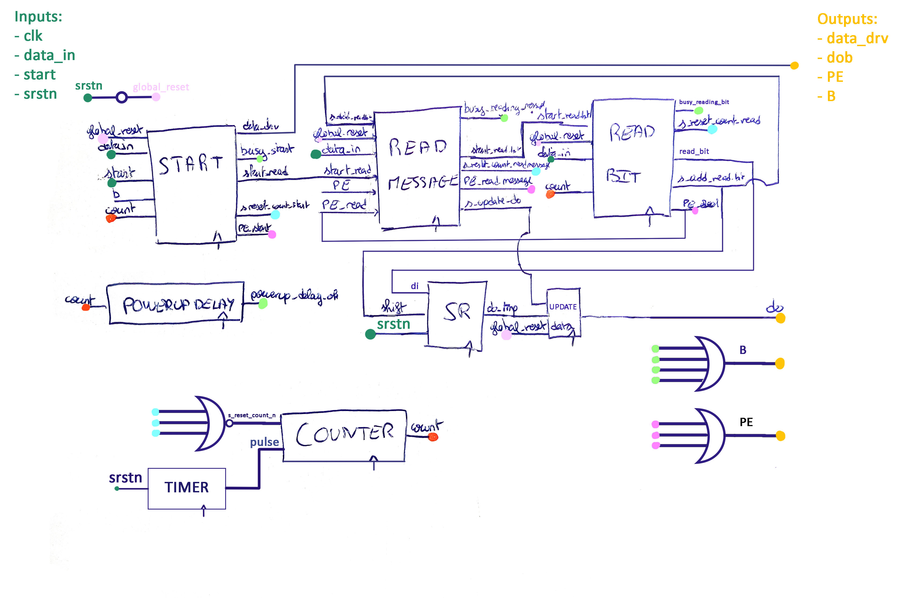

<!-- vim: set textwidth=0: -->

# DHT11 controller project

## Authors

* Hubert ROSIER (hubert.rosier@eurecom.fr) 
* Fanny BERCHE (fanny.berche@eurecom.fr) 

-----------------------

## Block diagram

 Block diagram

-----------------------

## Technical details of the first version of dht11_ctrl.vhd

-  Entities:  
    -  [`shift_reg`](descriptors/entities.md#shiftregister)  
    -  [`timer`](descriptors/entities.md#timer) 
-  Controller's processes: 
    -  [`POWERUP_DELAY`](descriptors/misc.md#powerupdelay)  
    -  [`COUNTER`](descriptors/misc.md#counter)   
    -  [`START`](descriptors/start.md)  
    -  [Read processes:](descriptors/readprocesses.md)  
        *  [`READ_BIT`](descriptors/readprocesses.md#readbit)  
        *  [`READ_MESSAGE`](descriptors/readprocesses.md#readmessage)  
    -  [`UPDATE_DATA`](descriptors/misc.md#updatedata)   
- Stand alone processes:  
    -  [`CHECK_SUM`](descriptors/topprocesses.md#checksum) 
    -  [`PRINTER`](descriptors/topprocesses.md#printer) 

-----------------------

## Technical details of the second version of dht11_ctrl.vhd
After synthesis, we have found that the dht11 sensor doesn't respect the specification explained in its documentation.  
So we have decided to change the way we handle the counter checks and PE.  

The following processes have changed:   
-  Controller's processes: 
    -  [`START`](descriptors/start.md#synthesischanges)  
    -  Read processes:    
        *  [`READ_BIT`](descriptors/readprocesses.md#readbit#synthesischanges)  
        *  [`READ_MESSAGE`](descriptors/readprocesses.md#readmessage#synthesischanges)  

## Functional validation

We created small simulation environments to check if each process was doing what he was supposed to do. For example, we used the processes `checksum_test.vhd` to test the well
behaviour of the checsum process, `read_test.vhd` to test if we can read the bits sent.   

Then, we tested the entire controller with the first simulation given in class. 
We had some issues with the busy and the PE signals, mostly coming from two things : timing and lack of previous specifications.
Indeed, we hadn't completely specified in class the specific behaviour of PE and busy.
Also, due to the small frequency of the clock and the resets of the processes taking several clock cycles, we had some timing issues to solve.
We modified our code accordingly to get rid of the warnings.

We had to write a new controller to match with the second simulation, 
and especially to the dht11 sensor real specifications. 

-----------------------

## Synthesis

To be able to do the synthesis, we had to remove all the pieces of code that were supported only 
by the 2008 version (we were only using them to print messages).

We had clean reports, coherent with the design but we did a mistake that the synthesizer
didn't see: we forgot to remove the `wait` statements that cannot be synthesized.  

-----------------------

## Experiments on the Zybo

After putting our code into the SD card of the Zybo, we tried to use the dht11 sensor. 
We are not able to read any values from the sensor, we get a PE right at the start.
We were only able to check the correct behaviour when using the SW3 (to display errors). 

Then, we realize that these facts were due to the fact that we leave the `wait` statement
in our code and the synthesis works anyway.  
After removing them, the synthesis worked a little better but, we had to press the start
button severeal time before getting any value (the busy bit remained set in a random way) 
from the sensor and when it occured the value weren't very coherent (we always had a PE 
and sometimes a Checksum error).  
