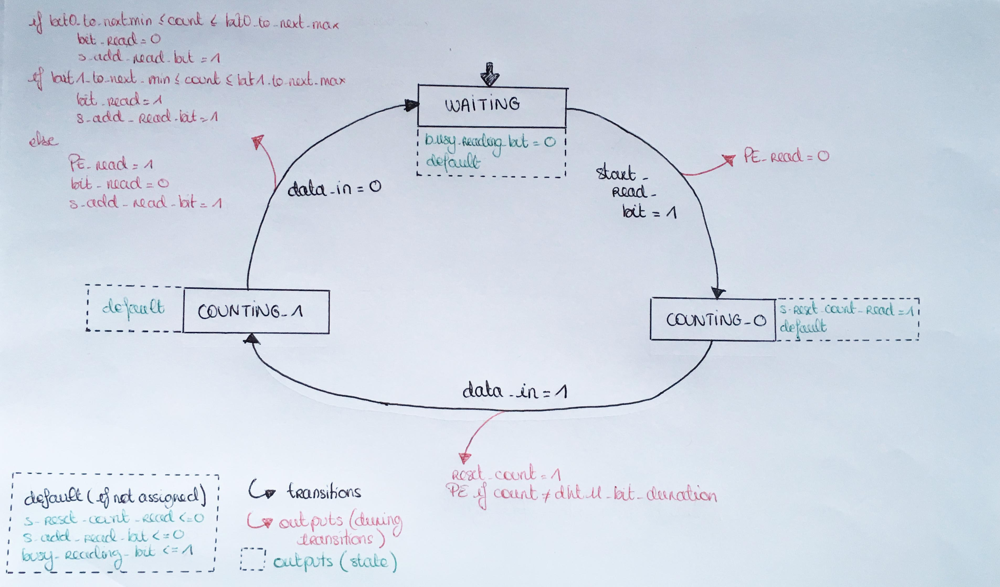
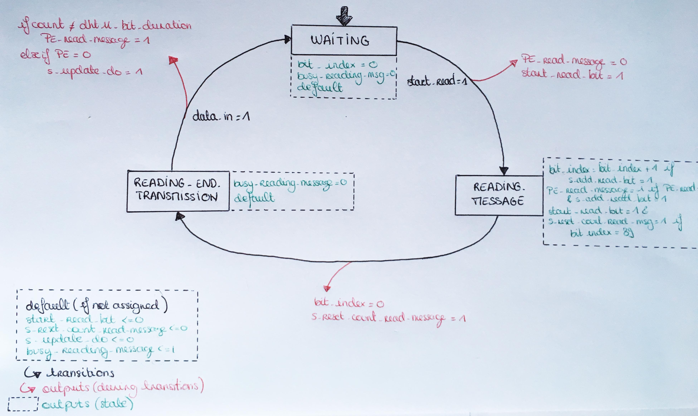

### <a name="readprocesses"></a> Read processes

To read the message sent by the sensor, we decided to implement two processes:  

  -  the READ_BIT process: its role is to understand which bit is sent by sensor.
  -  the READ_MESSAGE process: its role is to read the message sent by the sensor.

Basicaly, this process called the previous process 40 times.


#### <a name="readbit"></a> `READ BIT`  
##### Description  

This process is implemented as a 3 states machine:  
-  WAITING: the process is not reading a bit and it is waiting the start signal sent by
the READ_MESSAGE process.  
-  COUNTING0: the process is in this state when the data_in signal is set to 0.
It is the first phase of receiving one bit: the data_in is set to 0 for 50 us.
This state counts the time during which data_in is 0.  
-  COUNTING1: the process is in this state when the data_in signal is set to 1.
It is the second phase of receiving one bit: the data_in is set to 1 for 26-28 us to send '0' or for 70us to send a '1'.
This state counts the time during data_in is 1 and change the value of the signal `bit_read`
and tells the 40 bits register to store it (via the signal `s_add_read_bit`).  

##### Signal and variable
###### Signals
| Name                 | Type         | Direction | Description                                                                                |
| :----                | :----        | :----     | :----                                                                                      |
| `clk`                | `std_ulogic` | in        | Master clock. The design is synchronized on the rising edge of `clk`                       |
| `data_in`            | `std_ulogic` | in        | holds the value of the connection between the interface and the sensor                     |
| `start_read_bit`     | `std_ulogic` | in        | starts the process                                                                         |
| `count`              | `std_ulogic` | in        | holds the number of us elapse since the last reset of the counter                          |
| `busy_reading_bit`   | `std_ulogic` | out       | tells if the process is running (`1`) or not (`0`)                                         |
| `bit_read`           | `std_ulogic` | out       | holds the value of the last bit read                                                       |
| `s_add_read_bit`     | `std_ulogic` | out       | *Synchronous* signal that tells the 40bits shift register to store the value of `bit_read` |
| `s_reset_count_read` | `std_ulogic` | out       | *Synchronous* signal reset that resets the value of `count`                                |
| `PE_read`            | `std_ulogic` | out       | set in case of Protocol error when reading a bit                                           |

###### Intern variable
| Name       | Type              | Description                                                     |
| :----      | :----             | :----                                                           |
| `state`    | `states_read_bit` | describe the state of the process (WAITING,COUNTING0,COUNTING1) |

##### Block diagram

```
                   _ _ _ _ _
                  |         |
                  |         |------> busy_reading_bit
start_read_bit -->|         |------> s_reset_count_read
         count -->|  READ   |------> bit_read
       data_in -->|   BIT   |------> PE_read
                  |         |------> s_add_read_bit
                  |_ _ _ _ _|
                       ^
                       |
                      clk

```
##### Block diagram  

<p align="center"></p>
<p align="center">State diagram of the process READ_BIT</p>


#### <a name="readmessage"></a> `READ_MESSAGE`
##### Description
This process is implemented as a 3-state machine :

-  `WAITING`:

The process is waiting for the `start_read` signal to start reading the message sent by the sensor.
When switching to the state SENDING0_START, the process:  
    - Unsets `PE_read_message`
    - Starts the process `READ_BIT` by setting `start_read_bit`

-  `READING_MESSAGE`:
We are in this state until all the bit are read and stored in `do_tmp`.
During this state, whenever `s_add_read_bit` is set, we increment `bit_index` and reset the counter.
If a PE error happens during the reading of a bit, we have a PE during reading message
When `bit_index` equals 40, we have read all the bits sent and we switch to the next state.
When switching to the next state, the process:  
    - Resets the counter by setting `s_reset_count_read_message`
    - Resets `bit_index` to 0;

-  `READING_END_TRANSMISSION`:

When the last bit data is transmitted, DHT11 pulls down the voltage level and keeps it for 50us.
Then the Single-Bus voltage will be pulled up by the resistor to set it back to the free status.
In this state, we check that the sensor is really doing that.
When the voltage is set back to the free status (`data_in='1'`), we check the value of `count` and change state to `WAITING`.
If there wasn't any PE during the transmission, the process sets `s_update_do` to copy `do_tmp` to `do`.
When switching to the next state, the process:  
    - Sets `s_update_do` if no PEs
    - Unsets `busy_reading_message`

##### Signals and variables
##### Signals
| Name                         | Type         | Direction | Description                                                            |
| :----                        | :----        | :----     | :----                                                                  |
| `clk`                        | `std_ulogic` | in        | Master clock. The design is synchronized on the rising edge of `clk`   |
| `global_reset`               | `std_ulogic` | in        | reset all the processes                                                |
| `start_read`                 | `std_ulogic` | in        | starts this process (`READ_MESSAGE`)                                   |
| `s_add_read_bit`             | `std_ulogic` | in        | tells if the process `READ_BIT` has finished reading a bit             |
| `data_in`                    | `std_ulogic` | in        | holds the value of the connection between the interface and the sensor |
| `PE_read`                    | `std_ulogic` | in        | set in case of Protocol error when reading a bit                       |
| `PE`                         | `std_ulogic` | in        | tells if a PE has happened since the last start of transmission        |
| `busy_reading_message`       | `std_ulogic` | out       | tells if this process is running (`1`) or not (`0`)                    |
| `start_read_bit`             | `std_ulogic` | out       | starts the process `READ_BIT`                                          |
| `s_reset_count_read_message` | `std_ulogic` | out       | resets the counter from the `READ_MESSAGE` process                     |
| `PE_read_message`            | `std_ulogic` | out       | tells if a PE happens during the transmission of the data              |
| `s_update_do`                | `std_ulogic` | out       | starts the process `UPDATE_DATA` that will put the message read to `do`|


##### Variables
| Name        | Type                    | Description                                                                                |
| :----       | :----                   | :----                                                                                      |
| `state`     | `states_read_message`   | describe the state of the process (`WAITING`,`READING_MESSAGE`,`READING_END_TRANSMISSION`) |
| `bit_index` | `integer range 0 to 39` | holds the value of the index of the last bit read                                          |

##### Block diagram

```
                    _ _ _ _ _
                   |         |
   global_reset -->|         |
     start_read -->|         |------> busy_reading_message
 s_add_read_bit -->|  READ   |------> start_read_bit
        data_in -->| MESSAGE |------> s_reset_count_read_message
        PE_read -->|         |------> PE_read_message
             PE -->|         |------> s_update_do
                   |_ _ _ _ _|
                        ^
                        |
                       clk

```

##### State diagram  

<p align="center"></p>
<p align="center">State diagram of the process READ_MESSAGE</p>
