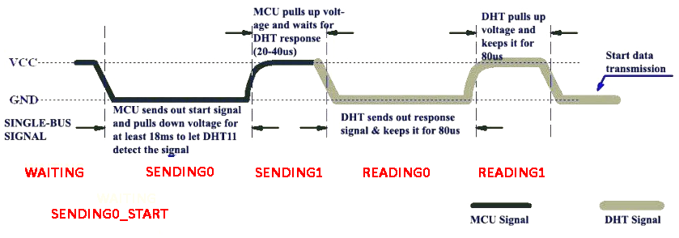
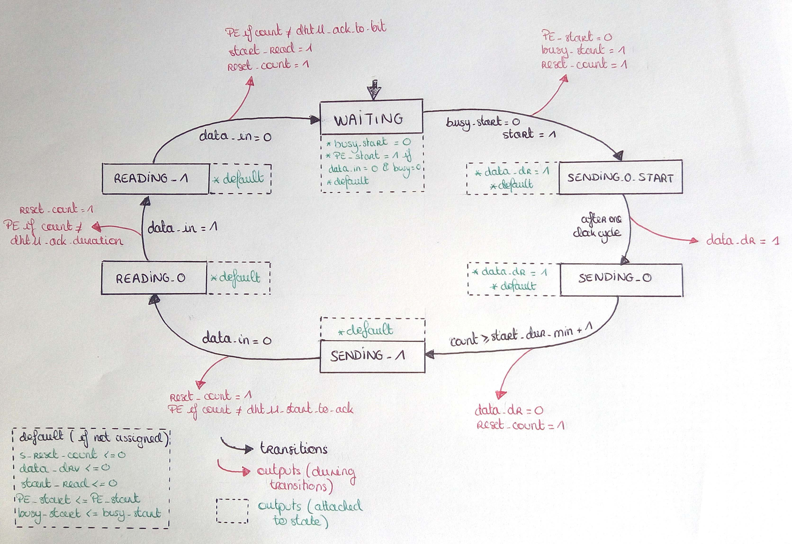

### <a name="start"></a> `START_PROCESS`
#### Description

The process goals is to send the start signal to DHT as explained in the next image:  

                                                                                          

This process works as a 6 states machine (WAITING,SENDING0,SENDING0_START,SENDING1,READING0,READING1).  

-  `WAITING`:  
The process is waiting for the `start` signal to start sending the start signal to the sensor.
In this state, the process checks if the DATA bus is controlled by the sensor whereas it shouldn't (`busy='0'` and `data_in='1'`).
When switching to the state SENDING0_START, the process :

    - Unsets `PE_START`
    - Sets `busy_start`
    - Resets the counter by setting `s_reset_count_start`

-  `SENDING0_START`:  
This state only lasts a clock cycle and its goal is to let some times to the counter to reset.
This states also set `data_drv`, the counter will count the time the DATA bus voltage is low.
If we don't we have errors in the next state because we check if `count` is not too high.

-  `SENDING0`:  

In this state, the DATA bus voltage is maintained to low until the value of `count` reached 18000
then the process switches to the state `SENDING1` state.
When switching to the next state, the process:  
    - Unsets `data_drv`
    - Resets the counter by setting `s_reset_count_start`

-  `SENDING1`:  

In this state, the DATA bus voltage is release to 1 and we wait for the sensor to set in to 0.
When the sensor take back the control of the line, we check if the time during which the voltage is set to 1 is between 20 and 40 us.
If it is the case we continue to the next state. If not we set `PE_start` to 1 and continue to the next state.
When switching to the next state, the process:  
    - Resets the counter by setting `s_reset_count_start`

-  `READING0`:  

In this state, the DATA bus voltage is forced to 0 by the sensor for 80 us.
When the voltage is again released to 1, we check if the time during which the voltage was set to 0 is 80 us
and go to the next state.
If it is not the case, we set `PE_start` to 1 and continue to the next state.
When switching to the next state, the process:  
    - Resets the counter by setting `s_reset_count_start`

-  `READING1`:  

In this state, the DATA bus voltage is released to 1 for 80 us.
When the voltage is forced back to 0, we check if the time during which the voltage was set to 1 is 80 us
and go to the `WAITING` state.
If it is not the case, we set `PE_start` to 1 and continue to the `WAITNG` state.
When switching to the next state, the process:
    - Sets the signal `start_read` to start the process `READ_MESSAGE`
    - Resets the counter by setting `s_reset_count_start`

##### Error handling
When an Protocol error occurs `PE_start` is set to 1 until the `start` signal is set when busy is unset.


#### Signals and variables
##### Signals
| Name                  | Type         | Direction | Description                                                              |
| :----                 | :----        | :----     | :----                                                                    |
| `clk`                 | `std_ulogic` | in        | Master clock. The design is synchronized on the rising edge of `clk`     |
| `global_reset`        | `std_ulogic` | in        | reset all the processes |
| `busy`                | `std_ulogic` | in        | tells if a process is already running or if the sensor is not ready |
| `start`               | `std_ulogic` | in        | starts the process |
| `data_in`             | `std_ulogic` | in        | holds the value of the connection between the interface and the sensor |
| `count`               | `std_ulogic` | in        | holds the number of micro seconds elapsed since the last reset of the counter |
| `busy_start`          | `std_ulogic` | out       | tells if the process is running (`1`) or not (`0`)  |
| `data_drv`            | `std_ulogic` | out       | if set to 1, the data bus level to `0`  |
| `s_reset_count_start` | `std_ulogic` | out       | reset the counter |
| `PE_start`            | `std_ulogic` | out       | tells if there is a PE during this process  |
| `start_read`          | `std_ulogic` | out       | tells if the process `READ_MESSAGE` to start reading the data sent  |

##### Variables

| Name        | Type                   | Description                                        |
| :----       | :----                  | :----                                              |
| `state` |  `states_start` |  describe the state of the process (WAITING,SENDING0,SENDING0_START,SENDING1,READING0,READING1); |

#### Block diagram

```
                 _ _ _ _ _
                |         |
global_reset -->|         |------> busy_start
        busy -->|         |------> data_drv
       start -->|  START  |------> s_reset_count_start
       count -->|         |------> PE_start
     data_in -->|         |------> start_read
                |_ _ _ _ _|
                      ^
                      |
                     clk

```

#### State diagram  

<p align="center"></p>
<p align="center">State diagram of the process START</p>

---------
