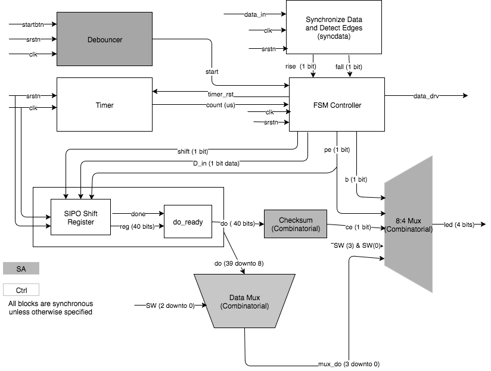

<!-- vim: set textwidth=0: -->

# DHT11 controller project

## Authors

* Nick MANFREDI (<manfredi@eurecom.fr>)
* Honey KURIAN (<kurian@eurecom.fr>)
* Hamdi AMMAR (<ammar@eurecom.fr>)
* Duy KHUONG (<khuong@eurecom.fr>)

## Block diagram

### DHT11 Stand alone version


### DHT11 AXI version


## Technical details

### DHT11 Controller

#### FSM Controller

* Functional: Finite-State Machine controller
* Entity name: `fsm`
* I/O Ports:

| Name       | Type                            | Direction | Description    |
| :----      | :----                           | :----     | :----      |
| `clk`      | `std_ulogic`                    | in        | Master clock. The design is synchronized on the rising edge of `clk`.   |
| `srstn`    | `std_ulogic`                    | in        | *Synchronous*, active low reset.        |
| `count`    | `std_ulogic`                    | in        | Number of `microseconds` counted by the `timer`         |
| `start`    | `std_ulogic`                    | in        | Start signal received from the `debouncer`.|
| `rise`    | `std_ulogic`                 | in        | A signal from  `syncdata`, asserted for 1 clock cycle when the data input signal rises from low to high.   |
| `fall`    | `std_ulogic`                 | in        | A signal from `datasync`, asserted for 1 clock cycle when the data input signal falls from high to low.        |
| `shift`   | `std_ulogic`                 | out        | Signal sent to `SIPO` to notify that 1-bit of data is being sent and needs to be stored in the SIPO.        |
| `dout_sipo`   | `std_ulogic`                 | out        | 1-bit of data that is sent to the SIPO continuously.   |
| `b`       | `std_ulogic`                 | out        | `Busy` signal. Asserted high when the input data is being processed.        |
| `pe`      | `std_ulogic`                 | out        | `Protocol Error`. Asserted high when a protocol error is detected.        |
| `data_drv`    | `std_ulogic`                 | out        | Control signal to DHT11 sensor.        |
| `timer_rst`   | `std_ulogic`                 | out        | Asserted high when we want to reset the counter of `timer` so that it starts counting again from 0.   |

* Specifications:

  * The `fsm` is a 8-state Mealy machine whose states are `INIT`, `IDLE`, `MCU-DRIVE-1`, `MCU-DRIVE-2`, `DHT-DRIVE-1`, `DHT-DRIVE-2`, `RECEIVE-1`, and `RECEIVE-2`. The design is synchronized on the rising edge of `clk`. It uses `srstn` as its active low reset. The `INIT` state is the reset state. The following table gives some description about each state. 

| State     | Next state (OK) | Next state (Error)  |  Description    |
| :----     | :----           | :----           | :----           |
| `INIT`    | `IDLE`    |-| Reset state. After powering up the board.       |
| `IDLE`    | `MCU-DRIVE-1` |`IDLE` | Exactly `1 sec` after the `INIT` state, when any error occurs (timeout, protocol error,...), or when the input data transmission is complete, the MCU will quit the current state and go back to this one.   |
| `MCU-DRIVE-1`  | `MCU-DRIVE-2`  |`IDLE` | MCU Sends out Start Signal and pulls the line down for at least `18 ms`.   |
| `MCU-DRIVE-2`  | `DHT-DRIVE-1`  |`IDLE` | MCU de-asserts `data_drv` and waits for sensor response, for `20-40 us`.        |
| `DHT-DRIVE-1`  | `DHT-DRIVE-2`  |`IDLE` | DHT Sends out response signal and keeps it for `80 us`.     |
| `DHT-DRIVE-2`  | `RECEIVE-1`    |`IDLE` | DHT pulls up the voltage and keep it for `80 us`, get ready for sensor's output         |
| `RECEIVE-1`    | `RECEIVE-2`    |`IDLE` | First part of receiving 1-bit data, when DHT drives the voltage low for `50 us`.  |
| `RECEIVE-2`    | `RECEIVE-1` or `IDLE` |`IDLE` | Second part of receiving 1-bit data, when DHT drives the voltage high for `26-28us` (bit `'0'`) or `70us` (bit `'1'`). |

  * For the detail of state transition when the reset is not active, please see the diagram below. When reset is asserted, the machine is forced back to `INIT` (this is not shown here to keep the diagram from being too busy).


#### Timer

* Functional:  A timer which counts upwards from zero. This measures the elapsed time in microseconds and is used by the FSM controller
* Entity name: `timer`
* Generic parameters:

| Name       | Type                   | Description                                                         |
| :----      | :----                         | :----            |
|`freq`         |`positive` range `1` to `1000`|    Master clock frequency in MHz (also clock periods per micro-second) |
* I/O Ports:

| Name       | Type                            | Direction | Description    |
| :----      | :----                           | :----     | :----          |
| `clk`      | `std_ulogic`                    | in        | Master clock. The design is synchronized on the rising edge of `clk`.   |
| `srstn`    | `std_ulogic`                    | in        | *Synchronous*, active low reset.                                        |
| `timer_rst`| `std_ulogic`                    | in        | `timer_rst` is used to reset the count. When this bit is 1, the counter returns to zero.  |
| `count`    | `natural`                       | out       | `count` is the counter, in microseconds. For 1 second, for example, we need to wait 10^6 * freq clock cycles |

#### Serial-Input Parallel-Output (SIPO) Shift Register

* Functional: A shift (left) register that transforms a 1-bit serial input signal from `FSM Controller` to a 40-bit output data.
* Entity name: `sipo`
* I/O Ports:

| Name       | Type                            | Direction | Description                                                             |
| :----      | :----                           | :----     | :----                                                                   |
| `clk`      | `std_ulogic`                    | in        | Master clock. The design is synchronized on the rising edge of `clk`.   |
| `srstn`    | `std_ulogic`                    | in        | *Synchronous*, active low reset.                                        |
| `pe`    | `std_ulogic`                    | in        | `PE` (_Protocol Error_) signal, sent by `FSM`.                                        |
| `shift`    | `std_ulogic`                    | in        | Shift command input. The register shifts when `shift` is asserted high. |
| `d_in`       | `std_ulogic`                  | in        | Serial input from `FSM Controller`.                                     |
| `do`       | `std_ulogic_vector(39 downto 0)`| out       | 40-bit output value of the SIPO shift register.

* Architecture:
  * Every time FSM sends 1 bit of data to SIPO, it asserts `shift` to High for 1 clock cycle.
  * When received 1 bit, SIPO will shift the current data stored in a local register `reg` to the left and append the received bit to the right.
  * Each time, the local `bit_count` will be increased, until all of 40 bits are received.
  * When `bit_count=40`, the current value of `reg` will be set to output data `do`.
  * Whenever SIPO receives the `srstn` signal (active low) or `PE` signal:
      + Data on `reg` will be reset to `zero`.
      + `bit_count` will be reset to `zero`.
      + Output data `do` will be kept the same as the last successfully outputted data.

#### Synchronize Data and Detect Edges 

* Functional: Synchronize data and detect edges 
* Entity name: `syncdata`
* I/O Ports:

| Name       | Type                            | Direction | Description    |
| :----      | :----                           | :----     | :----      |
| `clk`      | `std_ulogic`                    | in        | Master clock. The design is synchronized on the rising edge of `clk`.   |
| `srstn`    | `std_ulogic`                    | in        | *Synchronous*, active low reset.                                        |
| `d_in`    | `std_ulogic`                    | in        | 1-bit input data sent by the sensor.                                        |
| `rise`    | `std_ulogic`                    | out        | rise is set to 1 if d_in changes from `0` to `1`.                                        |
| `fall`    | `std_ulogic`                    | out        | fall is set to 1 if d_in changes from `1` to `0`. If the input data has not changed, both rise and fall are `0`.                                   |

* Architecture:
  * Get a synchronous version of an asynchronous input signal.
  * Synchronization is conventionally done with a two-stage shift-register that is clocked by the target domain's clock. Our input is now synchronous to the sysclk. 
  * We need to detect a change, and we can do that by extending the shift-register, making it a three-stage shift register, and comparing the values of different bits:

  * The first stage of the shifter takes the hit of timing errors, and we compare the next two stages (C1 and C2) to see whether we have a rise or a fall on the input signal. We output two signals that indicate a rise or a fall; each will be high for one sysclk cycle. 

(Reference: <https://www.doulos.com/knowhow/fpga/synchronisation>)

### DHT11 Stand-alone (SA) wrapper

#### Checksum
* Functional: A complete data transmission is 40 bits(Most Significant Bits first). The checksum is the last 8 bits of this transmission and this value is compared with the sum of first 32 bits. If they are not equal, this entity will throw an error (output='1').
* Entity name: `checksum`
* I/O Ports:

| Name       | Type                            | Direction | Description    |
| :----      | :----                           | :----     | :----      |
| `do`       | `std_ulogic_vector(39 downto 0)`       | in        | 40-bit complete data. do(`7` downto `0`)  are the checksum bits.   |
| `ce`       | `std_ulogic`          | out        | CE (Checksum error): if this bit is set, it means that there is a checksum error.|
#### 32:4 Mux

* Functional: A multiplexer that selects 4 bits ( 1 signal) of 32 input bits  ( 1 signal ).The mux uses 1 select line(4-bit input) `SW` to select which chunk of bits to send to the output.
* Entity name: `datamux`
* I/O Ports:

| Name       | Type                                     | Direction | Description                                                                                                                                                                                        |
| :----      | :----                                    | :----     | :----                                                                                                                                                                                              |
| `d_in`       | `std_ulogic_vector(39 downto 0)`       | in        | 40-bit complete data (Most Significant Bits first).data to select is between `d_in(39)` and `d_in(8)`                                                                                              |
| `SW`       | `std_ulogic_vector(3 downto 0)`          | in        | 4-bit input (Selectors):1 switch SW(0) to select what to display(temperature or humidity) and 2 switches to select 4 bits out of the 16 bits (4 bits nibbles) of the data to display (SW1 and SW2). SW3 is not used.|
| `d_out`      | `std_ulogic_vector(3 downto 0)`        | out       | 4-bit output value of 32:4 Mux (input for the 8:4 Mux).                                                                                                                                            |
* Architecture:
  * We used a local signal `local_sw` and we assign the 3 Least Significant Bits of sw to it. 
  * Depending to our local signal `local_sw` and according to the common details (see above) we select 4 bits from `d_in` and asssign it to `d_out`.
  * All inputs are in the sensitivity list of the process, so the output will be updated each time a change occurs on the input data or on the switch vector sw.
  * The last 8 bits of the d_in are discarded and not used.

#### 8:4 Mux
* Functional: A multiplexer that selects 4 bits ( 1 signal) of 8 input bits  ( 4 signals ) which are outputs of `FSM Controller` and the `32:4 Mux`. There is no select line, the mux uses 1 input bit `SW(3)` to select which input line(s) to send to the output. The mux also combines multiples variables.
* Entity name: `d_select_mux2`
* I/O Ports:

| Name       | Type                            | Direction | Description                                                                                                                         |
| :----      | :----                           | :----     | :----                                                                                                                               |
| `PE`       | `std_ulogic`                    | in        | PE (Protocol error): if this LED in on this means that there was an error in the protocol.                                          |
| `B`        | `std_ulogic`                    | in        | B (busy bit): indicates that the delay after the power up is not passed or that the sensor is currently sending data.               |
| `CE`       | `std_ulogic`                    | in        | CE (Checksum error): if this bit is set, it means that the checksum sent and the one computed are different.                        |
| `SW`       | `std_ulogic_vector(3 downto 0)` | in        | 4-bit input: SW(3) to select what to display, data received from 32:4 Mux or we put the LEDs (the output) in an "error/check state".|
| `led`      | `std_ulogic_vector(3 downto 0)` | out       | 4-bit output value of 8:4 Mux.
* Architecture:
  * If SW(3) is set to 0 the LEDs will be in an "error/check state" . The bits will be displayed as follow : PE & SW(0) & B & CE . 
  * If SW(3) is set to 1 the LEDs will display the data received from the 32:4 Mux .
  * All inputs are in the sensitivity list of the process, so the LEDs will be updated each time a change occurs on the data or error/check bits or on the switch SW(3).

#### Debouncer

* Functional: Takes an iput button press and asserts a synchronous r, f, and a to reflect the state of the button. Used by the FSM to know when to start.
* Entity name: `debouncer`
* I/O Ports:

| Name       | Type                            | Direction | Description    |
| :----      | :----                           | :----     | :----      |
| `clk`      | `std_ulogic`                    | in        | Master clock. The design is synchronized on the rising edge of `clk`.   |
| `srstn`    | `std_ulogic`                    | in        | *Synchronous*, active low reset.                                        |
| `d`    | `std_ulogic`                    | in        | Input bouncing signal                                        |
| `q`    | `std_ulogic`                    | out        | Output synchronized and debounced signal                                     |
| `r`    | `std_ulogic`                    | out        | Rising edge detector                                       |
| `f`    | `std_ulogic`                    | out        | Falling edge detector                                        |
| `a`    | `std_ulogic`                    | out        | Any edge detector                                       |

### AXI Version
* Functional: In the AXI version of DHT11, instead of displaying to the LEDs we store the data in a register and respond to read requests for it. 
After the reset has been de-asserted, the wrapper waits for 1 second and sends the first start command to the controller. Then, it waits for one more second, samples DO(39 downto 8) (the sensed values) in DATA, samples the PE and CE flags in STATUS, and sends a new start command to the controller. And so on every second, until the reset is asserted. When the reset is de-asserted, every rising edge of the clock, the B output of the DHT11 controller is sampled in the B flag of STATUS.
To do this, we have 2 Moore FSMs: one for read requests and one for write requests.  They be seen in the diagrams below.

#### DHT11 AXI FSM - READ


#### DHT11 AXI FSM - WRITE


* Entity name: `dht11_axi`
* I/O Ports:

| Name       | Type                            | Direction | Description	|
| :----      | :----                           | :----     | :----		|
| `aclk`      | `std_ulogic`                    | in        | Master clock.   |
| `aresetn`    | `std_ulogic`                    | in        | *Synchronous*, active low reset.                                        |
| `s0_axi_araddr`    | `std_ulogic_vector (29 downto 0)`                    | in        |    Read address
| `s0_axi_arprot`    | `std_ulogic_vector (2 downto 0)`                    | in        | Protection type. The privilege level of the transaction and whether it is a data or instruction access.
| `s0_axi_arvalid`    | `std_ulogic`                    | in        | Read address valid. Indicates that the channel is signaling valid read address and control information.
| `s0_axi_rready`    | `std_ulogic`                    | in        | Read ready. Indicates that valid read data are available.
| `s0_axi_awaddr`    | `std_ulogic_vector (29 downto 0)`                    | in        | Write address
| `s0_axi_awprot`    | `std_ulogic_vector (2 downto 0)`                    | in        | Protection type
| `s0_axi_awvalid`    | `std_ulogic`                    | in        | Write address valid. Indicates that the channel is signaling valid write address and control information.
| `s0_axi_wdata`    | `std_ulogic_vector (31 downto 0)`                    | in        | Write data
| `s0_axi_wstrb`    | `std_ulogic_vector (3 downto 0)`                    | in        | Write strobe
| `s0_axi_wvalid`    | `std_ulogic`                    | in        | Write valid. Indicates that valid write data and strobes are available
| `s0_axi_bready`    | `std_ulogic`                    | in        | Write response ready
| `data_in`    | `std_ulogic`                    | in        |  The input data |
| `s0_axi_arready`    | `std_ulogic`                    | out        |  Read address ready                                   |
| `s0_axi_rdata`    | `std_ulogic (31 downto 0)`                    | out        |  Read data                                   |
| `s0_axi_rresp`    | `std_ulogic (1 downto 0)`                    | out        |  Read response                                   |
| `s0_axi_rvalid`    | `std_ulogic`                    | out        | Read valid. Indicates that valid read data are available                                |
| `s0_axi_awready`    | `std_ulogic`                    | out        | Write address ready. Indicates that the slave is ready to accept an address and the associated control signals.                                 |
| `s0_axi_wready`    | `std_ulogic`                    | out        | Write ready. Indicates that the slave can accept the write data.                                |
| `s0_axi_bresp`    | `std_ulogic (1 downto 0)`                    | out        | Write response                                   |
| `s0_axi_bvalid`    | `std_ulogic`                    | out        | Write response valid. Indicates that the channel is signaling a valid write response.                                    |
| `s0_axi_data_drv`    | `std_ulogic`                    | out        | The signal to drive the dht11.                                    |


## Functional validation

We created a `testbench` for each module in order to confirm their functionality individually. 

| Module    | Test bench file   |
| :----     | :----             |
| `timer`   | `timer_sim`       |
| `syncdata`| `syncdata_tb`     |
| `sipo`    | `sipo_sim`        |
| `checksum`| `checksum_sim`    |
| `datamux` | `datamux_tb`      |
| `8to4mux` | `8to4mux_tb`      |
| `fsm`     | `fsm_sim`         |
| `dht11_ctrl` | `dht11_ctrl_sim`           |
| `dht11_axi`       | `dht11_axi_sim`           |

```bash
$ make com
$ make U=<module> simi
```

Then we combine them together (instantiate from `DHT11 Controller`) and confirm the overall behavior.

* For SA version:
```bash
$ make com
$ make U=dht11_ctrl simi
```

* For AXI version:
```bash
$ make axi-com
$ make axi-simi
```

## Synthesis

### Interfaces configuration

Create a synthesis file for DHT11 project [dht11-syn.tcl](./dht11-syn.tcl) with some configurations as below:
```
array set ios {
        "clk"           { "L16" "LVCMOS33" }
        "rst"           { "R18" "LVCMOS33" }
        "btn"           { "Y16" "LVCMOS33" }
        "sw[0]"         { "G15" "LVCMOS33" }
        "sw[1]"         { "P15" "LVCMOS33" }
        "sw[2]"         { "W13" "LVCMOS33" }
        "sw[3]"         { "T16" "LVCMOS33" }
        "data"          { "V12" "LVCMOS33" }
        "led[0]"        { "M14" "LVCMOS33" }
        "led[1]"        { "M15" "LVCMOS33" }
        "led[2]"        { "G14" "LVCMOS33" }
        "led[3]"        { "D18" "LVCMOS33" }
}
```
(The settings above are deciced after referring to the documentation of: [Zybo board schematic](https://gitlab.eurecom.fr/renaud.pacalet/ds-2017/raw/master/doc/zybo_sch.pdf) and [Reference manual](https://gitlab.eurecom.fr/renaud.pacalet/ds-2017/raw/master/doc/zybo_rm.pdf)).

(Update: The professor released the environment for synthesis also. So, in our final program, we are not using our TCL file but the [Professor's one](./dht11_sa_top.syn.tcl). The information described above is kept just for reference).

### Start synthesis:

* For SA version:
```bash
$ make com
$ make syn
```

* For AXI version:
```bash
$ make axi-syn
```

_Note_: We updated the [Makefile](./Makefile) in order to make the Compilation, Simulation and Systhesis processes easier and autonomous.

### Building boot image

1. For SA version:
```
$ make boot 
```
The boot image will be created in the root directory (`$r`) as: `boot.bin`.

2. For AXI version:
```
$ make axi-boot 
```
The boot image will be created in the root directory (`$r`) as: `axi-boot.bin`.
(We have to rename it to `boot.bin` when copying to our Zybo board).

### Combine all the processes

* We updated the [Makefile](./Makefile) in order to make the Compilation, Simulation and Systhesis processes easier and autonomous.

* From **Compile** => **Synthesis** => **Make boot image**.

1. For SA version

```bash
$ make all
```

2. For AXI version

```bash
$ make axi-all
```

## Experiments on the Zybo

### Specifications
DHT send data over 40 bits which are used as stated in the schema below
We choose bits on those 40 to display according to the 3 first switches of the system (SW0 - SW2)
```
    SW0,SW1,SW2  
     1   1   1      1  1  0      1  0  1      1  0  0  |  0   1   1     0  1  0      0  0  1      0  0  0  |  not displayed
   +------------+------------+------------+------------+------------+------------+------------+------------+-----------------+
   |    1010    |    0110    |    0001    |    0100    |    0010    |    1110    |    0011    |    1100    |     01011001    |
   +------------+------------+------------+------------+------------+------------+------------+------------+-----------------+
                      Humidity data                    |                   Temperature                     |     CHECK SUM

```    

### Stand Alone Result
| Image | `SW-0` `SW-1` `SW-2` | `SW-3` | Meaning |  `LED-3` `LED-2` `LED-1` `LED-0` | 
| :---  |:---  |:---  |:---  |:---  |:---  |:---  |
||  `111`   |  `1`  |Humidity[15:12]|`0010` |
||  `110`   |  `1`  |Humidity[11:8] |`1101` |
||  `101`   |  `1`  |Humidity[7:4]  |`0000` |
||  `100`   |  `1`  |Humidity[3:0]  |`0000` |
||  `011`   |  `1`  |Temperature[15:12]|`0001`|
||  `010`   |  `1`  |Temperature[11:8]|`1000`|
||  `001`   |  `1`  |Temperature[7:4]|`0000`    |
||  `000`   |  `1`  |Temperature[3:0]|`0000`|
||  `1--`   |  `0`  |Status[`PE`:`SW-0`:`B`:`CE`]|`0100`|

* Calculated value of:
    * **Humidity**: `0b0010110100000000` = `0x2d` = `45` (%)
    * **Temperature**: `0b0001100000000000` = `0x18` = `24` (degree Celsius)

### AXI Result

```bash
Sab4z>
Sab4z> devmem 0x40000000 32
0x37001800
Sab4z> devmem 0x40000004 32
0x00000000
Sab4z> devmem 0x40000008 32
Unhandled fault: external abort on non-linefetch (0x018) at 0xb6f76008
pgd = de7d8000
[b6f76008] *pgd=1e7ce831, *pte=40000783, *ppte=40000e33
Bus error
Sab4z> devmem 0x40000000 32 0
Unhandled fault: external abort on non-linefetch (0x1818) at 0xb6fcc000
pgd = dd8c0000
[b6fcc000] *pgd=1d94d831, *pte=40000743, *ppte=40000c33
Bus error
Sab4z> devmem 0x40000004 32 0
Unhandled fault: external abort on non-linefetch (0x1818) at 0xb6f58004
pgd = de7d8000
[b6f58004] *pgd=1d94d831, *pte=40000743, *ppte=40000c33
Bus error
Sab4z> devmem 0x40000008 32 0
Unhandled fault: external abort on non-linefetch (0x818) at 0xb6ff4008
pgd = dd8c0000
[b6ff4008] *pgd=1da49831, *pte=40000743, *ppte=40000c33
Bus error
Sab4z>
```
* Calculated value of:
    * **Humidity**: `0x37` = `55` (%)
    * **Temperature**: `0x18` = `24` (degree Celsius)
