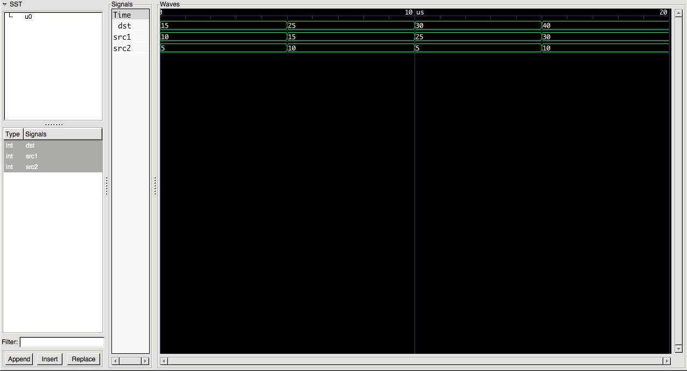

### Contributors
    - Hubert Rosier
    - Fanny Berche
    - Caroline Astolfi
    - Alexis Challande

## Debugging VHDL code

There are several ways to debug a `VHDL` code just as for other languages such as `python` or `java`.
But unlike these languages, a simulation is required to debug VHL code.
You can use those simulators to do so :   
- `GHDL` : open-source simulator and runs on Linux, Windows and Apple OS X. To download it, see [its official website](http://ghdl.free.fr/).  
- `ModelSim` : proprietary simulator developed by Mentor Graphics. The starter version is free, not the full one. See [the evalution version](http://go.mentor.com/4hagd) or the [student version](https://www.mentor.com/company/higher_ed/modelsim-student-edition).

### The classic print sentence
In VHDL to print something, one can use the functions `writeline(output,[…])` or `report` in the code.
Here is an example of how to use those print functions :

```vhdl
--  Imports the standard textio package.
use std.textio.all;

--  Defines a design entity, without any ports.
entity hello_world is
end hello_world;

architecture behaviour of hello_world is
begin

    process
        variable l: line;
        variable a,b: integer;
    begin
        -- Basic writting
        write(l, String'("Hello world!"));
        writeline(output, l);
        -- Will output: Hello world!

        -- Get the value of a variable
        a:=8;
        b:=10;
        write(l, String'("A: ") & to_string(a) & String'(" B: ") & to_string(b));
        writeline(output, l);

        -- Note: Since VHDL 2008, it's possible to cast integer to string using the function to_string()
        --       Before, you will have to use integer'image()

        -- Another option is to use the "report" function
        report "A: " & to_string(a) & " B: " & to_string(b);

        -- You should always try to aim to use report because you can assign level to the report
        report "This is a warning" severity warning;
        report "This is an error" severity error;

        wait;
    end process;
end behaviour;

```

Remarks : for more informations about `write` and `report`, see the following websites: [write](https://www.csee.umbc.edu/portal/help/VHDL/samples/samples.html), [report](https://www.ics.uci.edu/~jmoorkan/vhdlref/assert.html).  

To compile your code :  


  -  Using `GHDL` you can run this command lines:  


  ```bash
  mkdir gh_work  # To create a working directory where ghdl will create intermediate files
  ghdl -a --workdir=gh_work --std=08 hello_world.vhd  # to analyse the VHDL code
  ghdl -e --workdir=gh_work --std=08 hello_world # to elaborate the VHDL code
  ghdl -r hello_world
  ```

  Remarks: the option --workdir=DIR_NAME specifies to ghdl that we want it to work in the directory named DIR_NAME.  
  The option --std=08 specifies that we want to use the 2008 version of VHDL.

  - Using Model Sim (assuming the binaries of ModelSim are in the Path):

	```bash
	# Compile the file we just created
	vcom hello.vhd
	# Simulate it
	vsim hello_world # We use the name of the entity in the file here
	# In the VisualSim window, you should see a complete interface. You can use the "run" command
	# to run your design
	```

- The output should be similar to this one:

>  Hello world!
>  
>  A: 8 B: 10
>  
>  \** Note: A: 8 B: 10
>  
>  Time: 0 ns  Iteration: 0  Instance: /hello_world
>     
>  \** Warning: This is a warning
>  
>  Time: 0 ns  Iteration: 0  Instance: /hello_world
>     
>  \** Error: This is an error
>  
>  Time: 0 ns  Iteration: 0  Instance: /hello_world


This kind of debugging code can be usefull if you want to know the content of a variable at some point.  
But as you can see in this simple example, printing the value of variables isn't really handy : the code is quite long.
This method becomes quite a mess when your code starts getting long and complicated, testing many things gets difficult and error-prone.
But fortunately, there are other ways to control your programs !

### Combine `report` and `assert`
One of the nice features of `report` is that it can be combined with the `assert` instruction.

The syntax is the following:

```vhdl
assert condition report string severity severity_level;
```
The condition is tested and if its result is a false the report is triggered.
See the example below.

```vhdl
-- Small example
entity assert_report is
end assert_report;

architecture arch of assert_report is
begin

    process
        variable a,b: integer;
    begin

        -- Define values for a and b
        a := 2;
        b := 12;

        -- Check if a is greater than b and report a note otherwise
        assert a > b report "A is smaller than b" severity note;

        -- Set a equal to b
        a := b;
        -- Check if a is different from b and report a failure otherwise
        assert a == b report "A is different from b" severity failure;

        wait;
    end process;
end arch;
```
This example should be straight forward. The first report is raised because `a` is clearly smaller than `b`.

However, the second one is not triggered because `a` is equal to `b`.

#### Severity levels
In `vhdl`, there is 4 differents `severity` levels ([reference](http://www.vhdl.renerta.com/mobile/source/vhd00007.htm)):

* NOTE can be used to pass information messages from simulation (example 1);
* WARNING can be used in unusual situation in which the simulation can be continued, but the results may be unpredictable
* ERROR can be used when assertion violation makes continuation of the simulation not feasible (example 3);
* FAILURE can be used when the assertion violation is a fatal error and the simulation must be stopped at once (example 4).


### Waveform viewer

With a waveform viewer, we can display and analyse multiple signals from the digital system simulated.
It enables us to monitor at a very low level (wire level) our design.  
There is a built-in waveform viewer in `ModelSim` but the `GHDL` users need to install another software to do so.
Installing gtkwave package on Ubuntu 14.04 is as easy as running the following command on terminal:

```
sudo apt-get update
sudo apt-get install gtkwave
```

#### Example

To understand how a waveform viewer can help us debug our VHDL code, lets take the example of a simple adder.  
It has two integer inputs src1 and src2 and one integer output which contains the value src1+scr2.  

```
       __________
 src1 |          |
 ---->|  adder   | dst
 src2 |          |----->
 ---->|          |
      |__________|

```

One possible VHDL implementation of this adder we used for this example is:    

```vhdl
entity adder is
    -- Define the input/output ports
    port (
        src1: in integer;
        src2: in integer;
        dst:  out integer
    );
end adder;

architecture behaviour of adder is
begin
    -- Simple adder between src1 and src2
    process(src1,src2)
    begin
        dst <= src1 + src2;
    end process;
end behaviour;
```

To test the well behaviour of the component, we use a simulation entity.
This entity will assign specific values to the inputs of the adder and read the corresponding output.  
For this example, we wrote a simple simulation entity where the value of the inputs change every 5 μs:  


```vhdl
--  Defines a design entity, without any ports.
entity adder_sim is
end entity adder_sim;

architecture sim of adder_sim is
    -- Define internals signals
    signal src1:   integer;
    signal src2:   integer;
    signal dst:   integer;

begin
    -- Link our entity with our adder
    u0: entity work.adder(behaviour) port map(src1 => src1, src2 => src2, dst => dst);

    process
    begin
        -- Send values, and see if the results is the one expected
        src1 <= 10;
        src2 <= 5;
        wait for 5 us;

        src1 <= dst;
        src2 <= 10;
        wait for 5 us;

        src1 <= dst;
        src2 <= 5;
        wait for 5 us;

        src1 <= dst;
        src2 <= 10;
        wait for 5 us;

        -- Eternal wait. Stops the process forever.
        wait;
    end process;

end architecture sim;
```

To compile and run this simulation:  


  - With `GHDL` and `gtkwave`:  

```bash
mkdir gh_work
ghdl -a --workdir=gh_work --std=08 adder.vhd adder_sim.vhd
ghdl -e --workdir=gh_work --std=08 adder_sim
ghdl -r adder_sim --vcd=adder_sim.vcd
```
Remarks: the option --vcd=FILE_NAME specify ghdl to dump into the VCD file FILENAME the signal values before each non-delta cycle.  
You can learn more about ghdl options in this [website](http://home.gna.org/ghdl/ghdl/Simulation-options.html)  


After running these commands, you should have a file named adder_sim.vcd which can be opened with gtkwave.  
Once you have added the three signals to the list of signals to display (select the signal in the left-bottom box and hit insert), you should have something like:




  - With `ModelSim`:  

```bash
vcom -2008 adder.vhd adder_sim.vhd
vsim -2008 adder_sim
```

In `ModelSim`, you can add the Wave window and start debugging using the wave window. See this [tutorial](https://www.microsemi.com/document-portal/doc_view/131618-modelsim-tutorial) to understand how it works (essentially chapter \#3)

- Results

As you can see, we can check if our component behaves as we wanted. The value of the dst signal is always the sum of the signals src1 and src2.  
With this method, we can monitor any signal at any moment.
This method is more convenient than the previous one but can also become quite messy when there are many signals to monitor.
For this reason an automatic check up can be quite efficient and time saving.


### Automatic test or testbench
The idea is to write within your simulation a process that checks if the value of some signals is correct. As you will add complexity to your code, this simulation can help you gain time in the debug phase.

The main objectives are to generate the values (or wavesforms) of the different input signals, to generate reference output and compare them with what your design provides, and to report if the test was a failure or a success.

```vhdl
use std.textio.all;

--  Defines a design entity, without any ports.
entity adder_sim_auto is
    end entity adder_sim_auto;

architecture sim of adder_sim_auto is
-- Define internals signals
    signal src1:   integer;
    signal src2:   integer;
    signal dst:   integer;

begin
    -- Link our entity with our adder
    u0: entity work.adder(behaviour) port map(src1 => src1, src2 => src2, dst => dst);

    GEN_VALUES : process
    begin
    -- Send values, and see if the results is the one expected
        src1 <= 10;
        src2 <= 5;
        wait for 5 us;

        src1 <= dst;
        src2 <= 10;
        wait for 5 us;

        src1 <= dst;
        src2 <= 5;
        wait for 5 us;

        src1 <= dst;
        src2 <= 10;
        wait for 5 us;

        -- Eternal wait. Stops the process forever.
        wait;
    end process;


    -- Process that checks the values
    CHECK_VALUES : process(src1, src2)
    variable l: line;
    begin

    assert dst = src1 + src2 report "Wrong value";
    -- Print "Wrong value" if your code doesn't pass the test.

    end process;

end architecture sim;
```

Automate some tests is a very good practise. Indeed, a rule of thum says you will spend 80% of your time debugging your code, Since it's often repetitive and error prone, it's good to do automate either repetitive tests or test for component not easily manually debuggable.

However, you should use manual testing for some parts of your code (especially if you don't trust your own testing code) [or to debug your debug code ;) ].

It is very important to check all the possibilities (your design may not work in some particular cases). Here is an very simple example to illustrate this :

```vhdl
library IEEE;
use ieee.std_logic_1164.all;
use ieee.numeric_std.all;

entity adder_bit_false is
-- Define the input/output ports
port (
        src1: in std_ulogic_vector(7 downto 0);
        src2: in std_ulogic_vector(7 downto 0);
        dst:  out std_ulogic_vector(7 downto 0)
);
end adder_bit_false;

architecture behaviour of adder_bit_false is
begin
    -- Bit by bit adder between src1 and src2
    process(src1,src2)
       variable sum : std_ulogic_vector(7 downto 0);
    begin

       sum := src1 xor src2;

    end process;
end behaviour;

```

This is a piece of code that is supposed to be a bit adder. It is, of course, not working (the xor is working bit by bit, and does not take into account the result of the previous operation and it eventual bit to carry over).

But, if you only test it with some simple values such as :

```vhdl
src1 <= "00000000";
src2 <= "00000000";

src1 <= "11001100";
src2 <= "00110011";
```

You will not be able to see that your design is not working, the result will be correct for those values.

With these inputs, you will be able to see that something is wrong :
```vhdl
src1 <= "11111111";
src2 <= "11111111";

src1 <= "11101101";
src2 <= "10110011";
```

And you will correct you code :

```vhdl
process(src1,src2)
    variable sum : std_ulogic_vector(8 downto 0);
begin

    sum := std_ulogic_vector((src1(7) & unsigned(src1)) + (src2(7) & unsigned(src2)));
    for i in 0 to 7 loop
        dst(i) <= sum(i);
    end loop;

end process;
```

### Good practices

1. Always fix the first error first ! It may have been propagated to the rest of your design.

2. Don't ignore warnings. Mmake sure you understand each of them, and then decide if it’s important or not; rather that simply ignoring them.

3. Simulators normally have various settings for debugging and optimization. It is a good idea to enable all debugging information and disable all optimization: at least at first.
Once you're confident your code is correct, then turn on the optimization (and turn debugging off) to get higher simulation speed.

4. Try rebuilding (if the tool go wrong for no apparent reason):
    - Delete all the files generated by compilation.  
    - Re-compile (analyse and elaborate) every files using the same option for each file.  
    - Re-run the main program.  

    Sometimes bug can appear for no obvious reasons and rebuilding your project can make them disappear.  

5. Put as much information as you know about your design when declaring variables. `VHDL` is a strongly typed language and you should use all restrictions possible to you variables (Bonus: may also reduce the hardware used to do synthetise your design).

    For example :

```vhdl
signal i : integer;
signal i : integer 0 to 255;
```
If, during the process, you try to assign -1 to i, you will get an error message only with the second declaration (bound checking).
