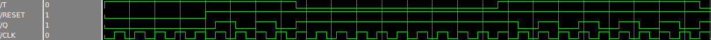

# SO Topic for Digital Systems course

## Authors

Marco Coletta

Axel Strubel

Cedric Osornio

Fernando Mendoza

Hamdi Ammar

## How to design combinatorial and sequential processes in VHDL

### Differences between combinatorial and sequential logic circuits:


* In general there are two kind of logic circuits:


 > Combinatorial circuits in which the outputs depend only on the input values through a boolean function. In other words a combinatorial circuit is such that it has not inferred memory elements.


 > Sequential circuits in which the outputs depend on the input values and the story of the circuit. In these kinds of circuits, memory elements are needed.


### VHDL code for combinatorial circuits
Combinatorial circuits can be described in VHDL using normal concurrent signal assignments or using a process. Since there are not memory elements, all assigned signals in a process are always explicitly assigned in all paths of the process statements.

Combinatorial processes have a sensitivity list after the syntax element "process". The sensitivity list specifies the set of signals, events on which a process may resume.

The process is activated if a value change appears on one of the sensitivity list signals.

Combinatorial processes' sensitivity list must contain all signals which appear in conditions such as if and any signal appearing on the right hand side of a assignment.

```vhdl
entity H_A is
port(
    A: in bit;
    B: in bit;
    S: out bit;
    C: out bit
    );
end H_A;

architecture beh of H_A is
begin
    process(A,B)
    begin
        S <= A xor B;
        C <= A and B;
    end process;
end beh;

```
### VHDL code for sequential logic circuits
Sequential logic circuits have a dependence between the values of the outputs and the previous values of the inputs. (as well as the current values of the inputs)

This suggests that this kind of circuits have memory elements. There are different kinds of sequential logic circuits: synchronous and asynchronous.

Since the purpose of this examples is to show differences between combinatorial and sequential circuits, we won't go into the details of sequential circuits but we will see only synchronous sequential circuits.

In synchronous circuits, as the name suggests, the changes in the state of memory elements are synchronized by a signal called clock.

Since the clock leads to a state change it must be present in the sensitivity list.

A simple example of a synchronous sequential logic circuits is described below:

```vhdl
entity T_FF is
port(
    T:     in  std_logic;
    CLK:   in  std_logic;
    RESET: in  std_logic;
    Q:     out std_logic
    );
end T_FF;

architecture beh of T_FF is
signal Q_sig: std_logic;
begin
    process(CLK,RESET)
    begin
        if (RESET='0') then -- asynchronous reset change in reset get immediately reflected on signal 'Q_sig'
            Q_sig <= '0';
        elsif CLK'event and (CLK = '1') then
	    if (T='1') then            
	        Q_sig <= not Q_sig;
	    end if;
        end if;
    end process;
    Q <= Q_sig;
end beh;

```


We can notice in the previous code that the reset is asynchronous because it's applied whenever the reset value changes to 0.  

The interest of this is to apply directly the reset and not wait the next clock cycle.  

If on the other hand we wanted to reset our circuit synchronously with our clock, we could produce the following code instead:  

```vhdl
begin
    process(CLK,RESET)
    begin
        if CLK'event and (CLK = '1') then --reset is now checked only at the rising edge of clock
            if (RESET='0') then
                Q_sig <= '0';
            endif;
	        if (T='1') then            
	            Q_sig <= not Q_sig;
	        end if;
        end if;
    end process;
    Q <= Q_sig;
end beh;

```
Synchronous reset have the following advantages:  

1. Sychronous reset have a better synchronization of all the flip-flops with Clock.
2. Synchronous reset can sometimes be synthetized with smaller flip-flops.

### Latches

Storage elements can be classified into latches and flip-flops.
A latch is a device with exactly two stable states: a high-output and a low-output. A latch has a feedback path, so information can be retained by the device.
Therefore latches are volatile memory devices, and can store one bit of data for as long as the device is powered. As the name suggests, latches are used to "latch onto" information and hold the data in place.

An SR latch (Set/Reset) is an asynchronous device: it works independently of control signals and relies only on the state of the S and R inputs.
The symbol, the circuit using NOR gates, and the truth table are shown below:


```vhdl

process(reset,enable,data_in)
    begin
        if (reset='1') then
            my_latch<='0';
        elsif (enable='1') then
            my_latch<=data_in;
        end if;
end process;

```
### Flip Flops

Flip-flops are clocked circuits whose output may change on an active edge of the clock signal based on its input. Unlike latches, which are transparent and in which output can change when the gated signal is asserted upon the input change, flip-flops normally would not change the output upon input change even when the clock signal is asserted. Flip-flops are widely used in synchronous circuits.

The D flip-flop is a widely used type of flip-flop. It is also known as a data or delay flip-flop. The D flip-flop captures the value of the D-input at a definite portion of the clock cycle (such as the rising edge of the clock). That captured value becomes the Q output. At other times, the output Q does not change. The D flip-flop can be viewed as a memory cell or a delay line. The active edge in a flip-flop could be rising or falling. The following figure shows rising (also called positive) edge triggered D flip-flop and falling (negative edge) triggered D flip-flop.


```vhdl

process(reset,clock)
    begin
        if (reset='1') then
            my_flipflop<='0';
        elsif rising_edge(clock) then
            my_flipflop<=data_in;
        end if;
end process;

```
Latter process shows the reset in the sensitivity list. In this way, if the reset is active, the flip-flop is reset even if the rising edge of the clock has not occurred.
 
