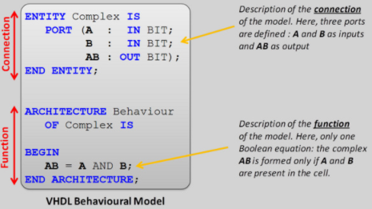
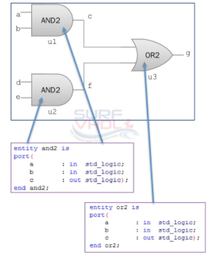

### Contributors
* Prerna Vishnu Birdhi   
* Maria Teresa Bevivino
* Michela Lecce
* Sejal Jain

# Behavioral and Structural architecture of VHDL
## Introduction
 
The architecture of an entity, specified by means of VHDL code, explains its internal design either by telling how the entity works or by describing how 
the inner structure is made. 
 
Each entity must have at least one architecture, therefore it is possible to find some entities with more than one architecture, in this case the 
designer will later specify which one to use. An architecture can be described by using a structural or a behavioral model. The architecture 
can also be used to describe a design at different levels of abstraction like gate level, register transfer level (RTL) or behavioral level.  This guide 
will illustrate the behavioural and the structural modelling in VHDL and will clarify how and why they differ from each other. 

 
Syntax of architecture:
``` 
    architecture architecture_name of entity_name
     	architecture_declarative_part;
     begin
    	Statements;
     end architecture_name; 
```

The architecture's statements should be inside the begin and end keyword. Architecture declarative part may contain variables, constants, or component 
declaration.
 
## Behavioural modelling
 
* A behavioral architecture describes the system in an algorithmic way
* It is a way to write code (more precisely to model the hardware design) based on it's functionalities.
* It is like writing the algorithm in order to solve the problem
* It describes the internal behavior of a component.


 
### Architecture
 
* In behavioral modelling style, the behavior of the entity can be expressed by using several processes made of different sequential statements which 
are very similar in syntax and semantics to the one of a high level programming language. 

* An architecture contains:
   * Cuncurrent processes
   * Signals declarations

* The order of the processes does not matter since they are executed in parallel.

### Processes

* Inside the process the execution of statements is sequential. A process may or may not contain a sensitivity list. If there is one, 
 the process waits for an event on any of the signals in the sensitivity list, and then the statements within the process are executed. Instead, if the 
 process does not have a sensitivity list, it will be immediately triggered, and it will have one or more wait statements which will specify the amount
 of time the process will wait for.

* A process contains:
   * Variables' declarations
   * Sequential statements
   * Signals' assignment statements
   * Variables' assignment statements
   * One or more wait statements

* If different values are assigned to the same signal within a process, just the last one will be the projected value of the signal and it will 
 determine the value this signal will assume during next process execution. 

Syntax of process: 
```
    process  [(sensitivity-list)]
    variables' declarations
    begin
      sequential statements;
      end process;
```

## Structural Modelling

* The structural description of an entity's architecture describes how the entity is internally composed. 
It is possible to exploit already done entities in order to have a hierarchical description and a more compact code and this also facilitates the model of complex systems. 
* A structural architecture also describes how the components are connected to each other. 

The VHDL code will follow a specific template: 

``` 
library library-name-1, library-name-2;
use library-name-1.package-name.all;
use library-name-2.package-name.all;

architecture SCHEMATIC of DESIGN is

    Component Declarations
    Internal Signal Declarations
    Component Specification
    Component Instantiation

end SCHEMATIC;
``` 

* The component declaration is used to declare components within the structure therefore there must be a declaration for every component in the structure. It 
looks like an entity declaration but it is not since the components are already been created in some previous project. 

* Internal signal declarations are used to declare internal signals within the architecture in order to create the "net". They allow the connection of all the different components 
in fact they will be used in the component instantiation part (this is really important since a mistake in how signals are used among components will lead to a malfunctioning or to a wrong 
design).

* Then there is the component specification which allow one to specify where the component architectures are coming from in other words the source libraries. 

* At the end it is possible to find the component instantiation which "creates" instances of the components within the design and specify how they are connected to other parts of the design. It 
is in this part that signals are used. 


* An example will clarify better: 

Structural architecture declaration example(AND OR entity structural implementation):



* In the above diagram,there are 4 input ports a, b, d, e and one output port g. The instances u1 and u2 of the two AND gates are connected to the u3 one using two wires named c and f. 
The figure above shows the entity declaration for AND2 and OR2 component.

## Differences between behavioural and structural architectural design of VHDL
 
 
The  main differences between structural and behavioural modelling are as follows:
 
* Behavioural Architecture of VHDL means describing the behaviour of VHDL in an algorithmic way where as Structural architecture means assembling the expected components of VHDL to 
realize the expected global function.
 
* Structural is always synthesize-able (if the assembled components are synthesize-able) while behavioural is not: if a behavioural description makes use of files, pointers and other 
very software constructs, then it is not synthesize-able.
 
* Behavioural descriptions can be much higher level than structural, because they can use the whole VHDL language, including very software-oriented constructs 
while structural is limited to the VHDL subset that deals with the assembling of sub-components.
 
* Behavioral is frequently used to design simulation environments because they are not synthesized and behavioural allows much higher level descriptions, 
that is, more compact, easier to design, maintain, or validate, less error prone, higher simulation speed.
 
 
Sources: http://electrosofts.com/vhdl/
                 http://slideplayer.com/slide/5212905/
                 http://www.fes.co.il/edu/course/vhdl/slides/VHDL07.pdf
               http://surf-vhdl.com/vhdl-syntax-web-course-surf-vhdl/vhdl-structural-modeling-style/
                https://www.slideshare.net/BhupendraPratapSingh1/behavioral-modelling-in-vhdl


 


