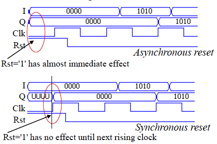

# Contributors
* Christian Palmiero
* Florian Kohler
* Matthias Clad
* Thibault Petitjean

# Synchronous vs Asynchronous Reset
The word "reset" outlines the behaviour of a hardware module when a reset input is asserted. The primary purpose of a reset is to initialise a design and to force it into a known state. 
There are two types of resets used in hardware design: the synchronous reset and the asynchronous reset. In the following topic, we will consider the clock rising edge as the active edge.

## Synchronous Reset
When the reset signal has a synchronous behaviour, reset signal effects are considered only at clock rising edges. The clock input signal has a higher priority with respect to the reset input signal: the reset check is performed at the rising edge of the clock.

Let us analyse the simple case of a register as example:
```vhdl
LIBRARY ieee;
USE ieee.std_logic_1164.ALL;

ENTITY Reg4 IS
    PORT (I: IN std_ulogic_vector(3 DOWNTO 0);
        Q: OUT std_ulogic_vector(3 DOWNTO 0);
        Clk, Rst: IN std_logic );
END Reg4;

ARCHITECTURE Beh OF Reg4 IS
BEGIN
    PROCESS (Clk)
    BEGIN
        IF (Clk = '1' AND Clk'EVENT) THEN
            IF (Rst = '1') THEN
                Q <= "0000";
            ELSE
                Q <= I;
            END IF;
        END IF;
    END PROCESS;
END Beh;
```

## Asynchronous Reset
When the reset signal has an asynchronous behaviour, reset signal effects are considered independently of the clock. The reset input signal has a higher priority with respect to the clock input signal: therefore, taking into account the previous example, the reset signal is included into the sensitivity list of the process.

```vhdl
LIBRARY ieee;
USE ieee.std_logic_1164.ALL;

ENTITY Reg4 IS
    PORT (I: IN std_ulogic_vector(3 DOWNTO 0);
        Q: OUT std_ulogic_vector(3 DOWNTO 0);
        Clk, Rst: IN std_logic );
END Reg4;

ARCHITECTURE Beh OF Reg4 IS
BEGIN
    PROCESS (Clk, Rst)
    BEGIN
        IF (Rst = '1') THEN
            Q <= "0000";
        ELSIF (Clk = '1' AND Clk'EVENT) THEN
            Q <= I;
        END IF;
    END PROCESS;
END Beh;
```

## Differences in waveforms
The two designs show relevant differences: it is worth having a look at their waveforms.


## Which design is better?
* The answer is: it depends!
* Each has pros and cons:
  *  Asynchronous reset
      * Can still work even if clock is not functioning or is not present
      * Has immediate effect and allows to achieve high speeds
      * May have metastability issues because it is sensitive to glitches
  * Synchronous reset
      * In the general cases, gives a completely synchronous design
      * Is not affected by metastability issues because the clock works as a filter for small reset glitches; however, if those glitches occur near the active clock edge, the design could go metastable
      * The reset pulse should be wide enough to be captured at the rising edge of the clock
      * Requires a clock to be active
* In all hardware modules that have a reset input signal, the reset behaviour must take priority over the regular behaviour
* Is a common practice to be consistent throughout a design, that is using either a synchronous or an asynchronous reset, but when it makes sense, synchronous and asynchronous resets can be mixed
