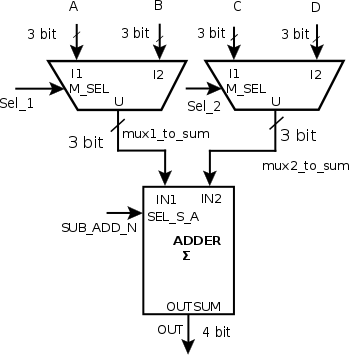

# The importance of components in complex VHDL projects

## Authors

* Francesco CONDEMI (<condemi@eurecom.fr>)
* Nick MANFREDI (<manfredi@eurecom.fr>)
* Honey KURIAN (<kurian@eurecom.fr>)
* Duy KHUONG (<khuong@eurecom.fr>)

## The problem 

VHDL can describe very complex systems, like whole processors, memory structures, and communication networks.
Different approaches can be used to handle that complexity. One approach, called the monolithic approach, consists in writing a single VHDL file that contains the entire hardware description of the circuit. This technique is not widely used, since the resulting files are large, difficult to debug, and error prone. Instead, VHDL programmers often prefer to divide and conquer by implementing a modular design. The VHDL modular design approach directly supports hierarchical design, which helps to understand complex digital  projects. 

Modular design provides the following benefits, which are similar to the ones that hierarchical design provides for other high level computer languages ( e.g. C, Python, etc.): 

* **Understandability**:  Packing "simple" functionality into modules makes the whole project easier to understand.
* **Reusability**: Sub-modules can be reused in several different projects, saving the designer time and removing the need to re-deign and re-test parts that have already been written.

## Sub-module declaration and port mapping 
Below is an example of sub-modules in VHDL. A hierarchical description of such a simple example is overkill, but it is presented here to illustrate the concept. The example implements an adder that can also perform subtraction. The adder takes as input two 3 bit long vectors selected from four 3 bit long vectors using two 2-to-1 multiplexers. The datapath is presented in figure.

**Step 1**: The first thing to do is to describe, in VHDL, every sub-module as an independent entity-architecture pair. In this case, we design the multiplexer and the adder with their entities and architectures. After having created the sub-modules' VHDL files, they must be included in the main project folder.

_multiplexer_

    library IEEE;
    use IEEE.STD_LOGIC_1164.ALL
    use IEEE.NUMERIC_STD.ALL

    entity mux2t01 is
      port(
        I1,I2:   in  unsigned (2 downto 0);
        M_SEL:   in  std_logic;
        U:       out unsigned (2 downto 0)
      );
    end entity mux2to1;

    architecture rtl of mux2to1 is
    begin
      muxprocess: process(I1,I2,M_SEL)
     begin 
      case M_SEL is
       when '0' => U<=I1;
       when others => U<=I2;
      end case;
     end process;
    end rtl;

_Adder_

    library IEEE;
    use IEEE.STD_LOGIC_1164.ALL
    use IEEE.NUMERIC_STD.ALL

    entity adder is
      port(
        IN1,IN2:     in  unsigned (2 downto 0);
        SEL_S_A:     in  std_logic;
        OUTSUM:      out unsigned (3 downto 0)
      );
    end entity adder;

    architecture rtl of adder is
    begin
      adderprocess: process(IN1,IN2,SUB_ADD_N)
     begin
      if (SEL_S_A='0') then
       OUTSUM <= IN1+IN2;
      else 
       OUTSUM<= IN1-IN2;
      end if;
     end process;
    end rtl;

**Step 2** : The next step is to create the complex project, including all the required elements. After having described the entity, the declaration of the sub-module is needed. "Declaration" refers to the act of making a particular design unit available for use in a particular design. 
A sub-module declaration must be done after the _architecture_ line and before the _begin_. The sub-module declaration is formed by modifying the associated entity so that _entity_ is replaced by the word _component_. The instantiation is terminated by the _end_ keyword. 
Additionally, it is necessary to declare, within the sub-module, all the internal signals required to connect the project's elements. They can be seen as an interface between the various design units instantiated in the final project.

    library IEEE;
    use IEEE.STD_LOGIC_1164.ALL
    use IEEE.NUMERIC_STD.ALL

    entity final_project is
      port(
        A,B,C,D:                 in  unsigned (2 downto 0);
        SUB_ADD_N,Sel_1,Sel_2:   in  std_logic;
        OUT:                     out unsigned (3 downto 0)
      );
    end entity final_project;

    architecture rtl of final_project is

      component mux2t01 is
           port(
            I1,I2:   in  unsigned (2 downto 0);
            M_SEL:   in  std_logic;
            U:       out unsigned (2 downto 0)
           );
      end component;

      component adder is
           port(
            IN1,IN2:     in  unsigned (2 downto 0);
            SEL_S_A:     in  std_logic;
            OUTSUM:      out unsigned (3 downto 0)
           );
      end component;
    
      signal mux1_to_sum : unsigned (2 downto 0);
      signal mux2_to_sum : unsigned (2 downto 0);
    begin
    
    ...
    ...

**Step 3** : The final step is to create an instance of the sub-modules and map the instances of the various sub-modules in the architecture body. The mapping step associates external connections from each sub-module to the signals of the complex project in which all the design units are declared. A good practice is to include labels for each instance of a sub-module. This increases the readability of the VHDL code.
There are two different approaches for "port mapping:"

_Direct mapping_

Each signal in the interface of a sub-module is directly associated with the corresponding signal in the main project, using the operator _=>_. On the left side of this operator is the sub-module's signal, and on the right side is the main project's signal.
The advantages of this approach are that it is explicit and the signals can be listed in any order. Moreover, signals with the same name can be mapped together (e.g. clock=>clock)
 
    ...
    ...
    begin 
    
    mux1 : mux2to1 port map (I1=>A, I2=>B, M_SEL=>Sel_1, U=>mux1_to_sum);
    mux2 : mux2to1 port map (I1=>C, I2=>D, M_SEL=>Sel_2, U=>mux2_to_sum);
    adder1 : adder port map (IN1=>mux1_to_sum, IN2=>mux2_to_sum, SUB_ADD_N=>SUBB_ADD_N, OUTSUM=>OUT);

    end rtl;

_Implied mapping_

In this approach, connections between external signals are associated with signals in the design unit by ordering the signals as they appear in the sub-module declaration. This method uses less space in the code because only signals from the main design appear in the mapping statement.
 
    ...
    ...
    begin

    mux1 : mux2to1 port map (A, B, Sel_1, mux1_to_sum);
    mux2 : mux2to1 port map (C, D, Sel_2, mux2_to_sum);
    adder1 : adder port map (mux1_to_sum, mux2_to_sum, SUBB_ADD_N, OUT);

    end rtl;

## Entity instantiation ##
The procedures presented above descrive the _component instantiation_ technique. However there is another way to model hierarchically: _entity instantiation_. It was introduced in VHDL'93 and allows skipping the usually redundant code needed by component instantiation. You can instantiate the entity directly:

labelname: entity work.entityName(architectureName) port map(...)

instead of 

labelname: componentName port map(...)

In our simple example, the code becames:

    ...
    ...
    begin 
    
    mux1 : entity work.mux2to1(rtl) port map (I1=>A, I2=>B, M_SEL=>Sel_1, U=>mux1_to_sum);
    mux2 : entity work.mux2to1(rtl) port map (I1=>C, I2=>D, M_SEL=>Sel_2, U=>mux2_to_sum);
    adder1 : work.adder(rtl) port map (IN1=>mux1_to_sum, IN2=>mux2_to_sum, SUB_ADD_N=>SUBB_ADD_N, OUTSUM=>OUT);

    end rtl;

In this way the redundant part of component instantiation will be eliminated and the code will be smaller. Moreover, while compiling the bigger project, if the components contain errors or are not yet compiled, an error message will appear and the project won't compile. Because of this, it's necessary to write the entity and the implementation of the component before compiling the main project.
This introduces a big limitation: the only way to build the whole project is a _bottom-up_ approach, and you will not be able to instantiate a black box. Another reason for prefering component instantiation is that for complex designs that are heavy to compile (e.g. CPUs), you might want to be able to change between different implementations of sub-units (such as different versions of them, or behavioral/RTL-models) without having to re-compile the entire project. 

